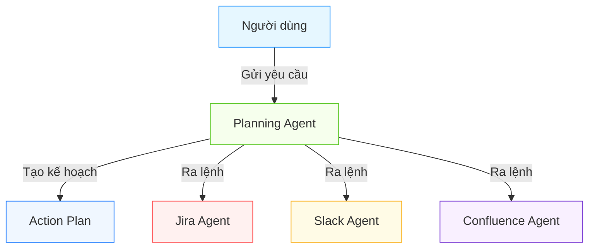
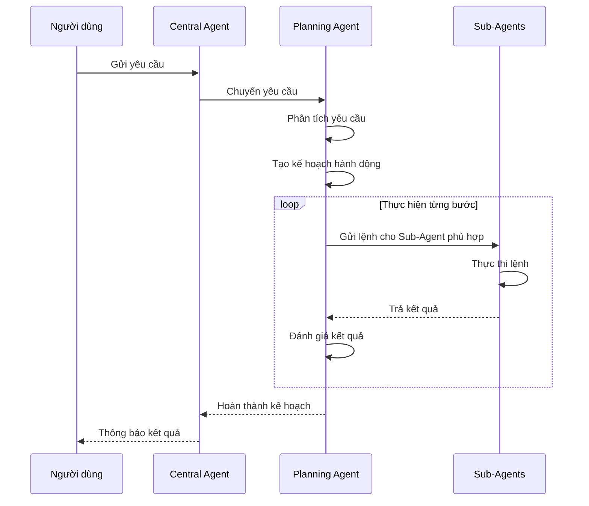

# Auto Workflow Agent - Central-Sub Agent Architecture

Hệ thống AI Agent tự động hóa quy trình làm việc dựa trên kiến trúc Central-Sub Agent, được xây dựng trên nền tảng NestJS.

## Giới thiệu dự án

Auto Workflow Agent là hệ thống AI Agent thông minh có khả năng tự động hóa các quy trình làm việc phức tạp. Hệ thống sử dụng kiến trúc Central-Sub Agent, trong đó Central Agent điều phối nhiều Sub-Agent chuyên biệt (JIRA, Slack, Calendar, Confluence, v.v.) để hoàn thành các tác vụ như quản lý công việc, lên lịch họp, và tạo báo cáo.

### Kiến trúc tổng quan

Hệ thống bao gồm các thành phần chính:

- **Central Agent**: Điều phối toàn bộ luồng xử lý
  - **Input Processor**: Phân tích yêu cầu người dùng (LLM-powered)
  - **Action Planner**: Lập kế hoạch hành động (LLM-powered)
  - **Agent Coordinator**: Điều phối các Sub-Agent thực hiện kế hoạch
  - **Result Synthesizer**: Tổng hợp kết quả (LLM-powered)
  - **Project Config Reader**: Đọc thông tin dự án, thành viên

- **Sub-Agents**: Các agent chuyên biệt thực hiện tác vụ cụ thể
  - JIRA Agent
  - Slack Agent
  - Calendar Agent
  - Confluence Agent
  - Email Agent

### Công nghệ sử dụng

- **Backend**: NestJS (TypeScript)
- **Database**: SQLite (phát triển), PostgreSQL (sản xuất)
- **LLM Integration**: OpenAI API (GPT-4, GPT-4 mini)
- **API Documentation**: Swagger

## Hướng dẫn cài đặt

### Yêu cầu hệ thống

- Node.js 16+
- npm hoặc yarn
- Git
- SQLite (dev) hoặc PostgreSQL (prod)
- Tài khoản OpenAI API

### Cài đặt chi tiết

1. **Clone repository**:
```bash
git clone https://github.com/phuc-nt/auto-workflow-agent.git
cd auto-workflow-agent
```

2. **Cài đặt dependencies**:
```bash
npm install
```

3. **Tạo file .env từ mẫu**:
```bash
cp .env.example .env
```

4. **Build dự án**:
```bash
npm run build
```

### Gỡ lỗi cài đặt thường gặp

- **Lỗi PORT đã được sử dụng**: Thay đổi cổng trong file .env hoặc kiểm tra các tiến trình đang chạy:
  ```bash
  lsof -i :3001  # Kiểm tra tiến trình đang sử dụng cổng 3001
  ```

## Hướng dẫn cấu hình

### Cấu hình cơ bản (.env)

```
# Cấu hình cơ bản
PORT=3001
NODE_ENV=development

# Database
DB_HOST=localhost
DB_PORT=3306
DB_USERNAME=root
DB_PASSWORD=
DB_DATABASE=dev-assist

# OpenAI
OPENAI_API_KEY=syour_openai_api_key
OPENAI_MODEL=gpt-4.1-mini
```

### Cấu hình nâng cao

#### Project Config (src/config/project_config_demo.json)

File cấu hình chứa thông tin về dự án, thành viên, và các công cụ được tích hợp:

```json
{
  "project": {
    "name": "Project X",
    "key": "XDEMO",
    "members": [
      {
        "id": "user123",
        "name": "Nguyễn Văn A",
        "email": "a@example.com",
        "slack": "U123456"
      }
    ]
  }
}
```

#### Cấu hình LLM (src/config/llm.config.ts)

Tùy chỉnh mô hình và prompt template:

```typescript
/**
 * Cấu hình mặc định cho LLM
 */
export const DEFAULT_LLM_CONFIG: LLMConfig = {
  model: 'gpt-4.1-mini', // Default model
  temperature: 0.7, // Default temperature
};

/**
 * Cấu hình prompt cho từng thành phần
 */
export const PROMPT_CONFIGS: Record<string, PromptConfig> = {
  inputProcessor: {
    systemPrompt: `
Bạn là một AI assistant được thiết kế để phân tích yêu cầu người dùng và chuyển thành mô tả chi tiết.

Với mỗi yêu cầu, hãy:
1. Phân tích ý định chính
2. Xác định các thông tin quan trọng (user, project, time, etc.)
3. Mô tả chi tiết những gì người dùng muốn thực hiện
...`,
    examples: [
      // Ví dụ về input/output
    ]
  },
  actionPlanner: {
    systemPrompt: `...` 
  },
  // ... các cấu hình khác
};
```

### Chạy ứng dụng

```bash
# Development mode
npm run start:dev

# Production mode
npm run build
npm run start:prod
```

## Kiểm thử

### Kịch bản kiểm thử

Dự án bao gồm nhiều kịch bản kiểm thử phức tạp để đánh giá khả năng của hệ thống:

1. **Kết thúc ngày làm việc**: Agent tự động tìm các task đang làm, cập nhật trạng thái, và thông báo cho team.
   ```bash
   curl -X POST "http://localhost:3001/central-agent/process" \
     -H "Content-Type: application/json" \
     -d '{"message": "tôi xong việc hôm nay rồi", "userId": "user123"}' --max-time 300
   ```

2. **Sắp xếp lịch họp**: Agent tìm khung giờ phù hợp và tạo cuộc họp mới.
   ```bash
   curl -X POST "http://localhost:3001/central-agent/process" \
     -H "Content-Type: application/json" \
     -d '{"message": "sắp xếp cuộc họp với Phúc, Đăng và Hưng để kickoff dự án X", "userId": "user123"}' | jq
   ```

Xem thêm kịch bản kiểm thử tại: `docs/testing/central_agent_test`

### Unit Tests

```bash
npm run test
```

## Tài liệu

Xem thêm tài liệu chi tiết:

- Kiến trúc tổng quan: [`docs/knowledge/ai_agent_development_guide_part1.md`](docs/knowledge/ai_agent_development_guide_part1.md)
- Chi tiết Central Agent: [`docs/knowledge/ai_agent_development_guide_part2.md`](docs/knowledge/ai_agent_development_guide_part2.md)
- Kế hoạch triển khai: [`docs/implementation/implementation_plan.md`](docs/implementation/implementation_plan.md)
- Kịch bản kiểm thử: [`docs/testing/central_agent_complex_scenarios.md`](docs/testing/central_agent_complex_scenarios.md)
- Tham khảo API: [`docs/dev-guide/tool_api_reference/`](docs/dev-guide/tool_api_reference/)
- Prompts: [`docs/dev-guide/prompts/central_agent_prompts.md`](docs/dev-guide/prompts/central_agent_prompts.md)

## Luồng xử lý tự động hóa

### Cách hệ thống Agent hoạt động

Auto Workflow Agent hoạt động dựa trên mô hình phối hợp thông minh giữa các agent chuyên biệt. Khi bạn gửi một yêu cầu đơn giản như "Tôi đã xong việc hôm nay", hệ thống sẽ thực hiện một loạt các hành động phức tạp để tự động hóa quy trình làm việc của bạn.

#### Minh họa luồng xử lý



#### Quy trình thực tế

Ví dụ với câu lệnh **"Tôi đã xong việc hôm nay"**, hệ thống sẽ hoạt động như sau:

1. **Người dùng gửi yêu cầu**
   - Bạn chỉ cần gửi một câu đơn giản "Tôi đã xong việc hôm nay"

2. **Planning Agent phân tích và lập kế hoạch**
   - Hiểu yêu cầu của bạn và tạo kế hoạch hành động chi tiết
   - Tự động chia công việc thành các bước nhỏ: kiểm tra công việc, xem logs, cập nhật trạng thái...

3. **Thực hiện từng bước tự động**
   - **Bước 1**: Jira Agent tìm kiếm các task đang xử lý của bạn hôm nay
   - **Bước 2**: Slack Agent tìm các tin nhắn liên quan đến task để nắm bắt tình hình
   - **Bước 3**: Jira Agent cập nhật trạng thái task thành "Done" và log thời gian làm việc
   - **Bước 4**: Confluence Agent tạo ghi chú cho daily meeting với thông tin về công việc đã hoàn thành

4. **Tất cả diễn ra tự động, nhanh chóng**
   - Thay vì phải mở nhiều ứng dụng và thực hiện thủ công từng bước
   - Hệ thống tự động thực hiện mọi thứ, tiết kiệm thời gian và đảm bảo không bỏ sót bước nào

### Lợi ích cho người dùng

- **Đơn giản hóa công việc**: Bạn chỉ cần nói yêu cầu bằng ngôn ngữ tự nhiên
- **Tiết kiệm thời gian**: Hệ thống tự động thực hiện các tác vụ lặp đi lặp lại
- **Giảm thiểu sai sót**: Không còn quên log work hay cập nhật trạng thái
- **Tích hợp liền mạch**: Kết nối tất cả các công cụ làm việc: Jira, Slack, Confluence...

Bất kể bạn có kiến thức kỹ thuật hay không, Auto Workflow Agent đều giúp tự động hóa quy trình làm việc của bạn một cách thông minh và hiệu quả.

### Chi tiết kỹ thuật

Luồng xử lý bên trong hệ thống diễn ra qua các bước sau:



#### Cơ chế hoạt động bên trong

1. **Central Agent** nhận yêu cầu từ người dùng và điều phối toàn bộ quá trình
   - Input Processor phân tích yêu cầu ban đầu
   - Chuyển giao yêu cầu tới Planning Agent
   
2. **Planning Agent** sử dụng AI để:
   - Hiểu ngữ cảnh yêu cầu
   - Phân tích thông tin cần thiết
   - Tạo kế hoạch hành động chi tiết
   - Chia nhỏ thành các bước cụ thể

3. **Sub-Agents** hoạt động theo lệnh từ Planning:
   - Mỗi Sub-Agent chuyên biệt cho một công cụ (Jira, Slack, Confluence...)
   - Nhận lệnh tương ứng với bước trong kế hoạch
   - Giao tiếp với API của công cụ tương ứng
   - Trả kết quả về Planning Agent
   
4. **Kết quả cuối cùng**:
   - Planning Agent tổng hợp kết quả từ tất cả Sub-Agents
   - Central Agent trình bày kết quả theo định dạng dễ hiểu
   - Thông báo cho người dùng về trạng thái hoàn thành

Tất cả các tương tác giữa các Agent được thiết kế để tự động và liền mạch, không yêu cầu can thiệp thủ công trong quá trình thực hiện.

### Ví dụ tương tác thực tế

Dưới đây là ví dụ về cuộc hội thoại thực tế giữa người dùng và hệ thống:

```
👤 Người dùng: Tôi đã xong việc hôm nay.

🤖 Agent: Tôi sẽ giúp bạn hoàn tất công việc cuối ngày. Đang xử lý...

🤖 Agent: Đã tìm thấy các task của bạn hôm nay:
   - XDEMO2-6: "Cập nhật tính năng đăng nhập" (In Progress)
   
🤖 Agent: Đã kiểm tra tin nhắn Slack liên quan đến task XDEMO2-6.
   Tìm thấy 3 tin nhắn từ bạn trong kênh #project-channel.

🤖 Agent: Đã cập nhật task XDEMO2-6:
   - Trạng thái: Done ✓
   - Log work: 8h ✓
   
🤖 Agent: Đã tạo ghi chú cho Daily Meeting ngày mai với nội dung:
   "Hoàn thành task XDEMO2-6: Cập nhật tính năng đăng nhập. 
    Chi tiết: Đã sửa lỗi xác thực và cải thiện trải nghiệm đăng nhập."

🤖 Agent: Đã hoàn thành tất cả các bước trong quy trình. Chúc bạn nghỉ ngơi tốt! 😊
```

Toàn bộ quy trình trên diễn ra tự động, không cần thêm bất kỳ input nào từ người dùng. Hệ thống thực hiện đồng thời nhiều tác vụ mà bình thường bạn phải làm thủ công qua nhiều ứng dụng khác nhau.

## License

[MIT Licensed](LICENSE)
