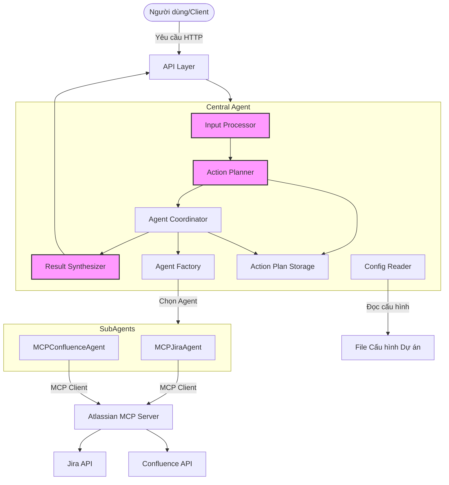
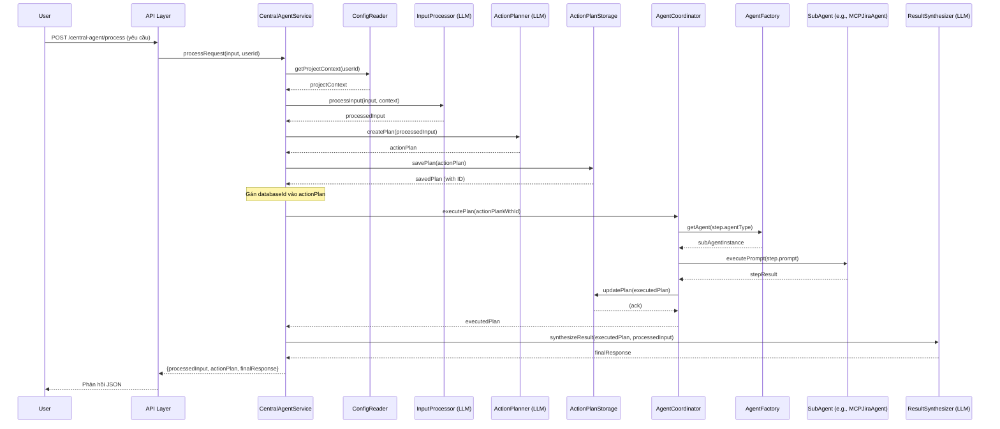
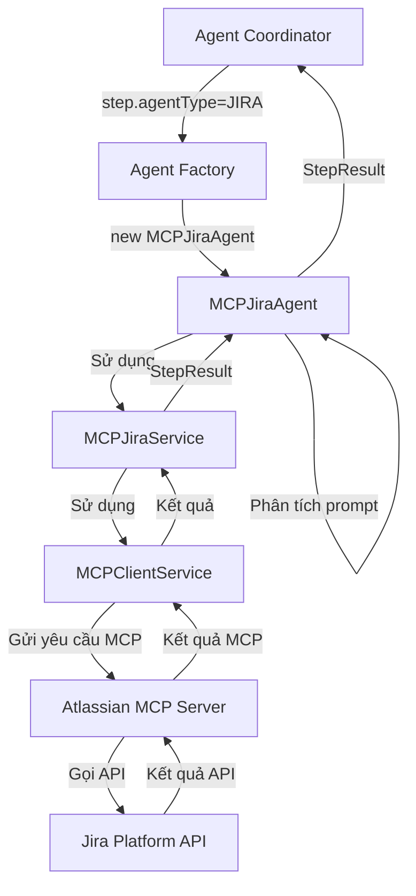

# Tài liệu Kỹ thuật Tổng quan: Auto Workflow Agent

## 1. Giới thiệu

### 1.1. Mục tiêu
Tài liệu này cung cấp cái nhìn tổng quan về kiến trúc kỹ thuật và luồng hoạt động của hệ thống Auto Workflow Agent. Mục tiêu của hệ thống là tự động hóa các quy trình làm việc phức tạp thông qua việc sử dụng một AI Agent trung tâm điều phối các Sub-Agent chuyên biệt. Người dùng có thể tương tác với hệ thống bằng ngôn ngữ tự nhiên để yêu cầu thực hiện các tác vụ như quản lý công việc, lên lịch họp, tạo báo cáo, và nhiều hơn nữa. Tài liệu này dành cho các kỹ sư phát triển, kiến trúc sư hệ thống và các bên liên quan muốn hiểu rõ hơn về cách hệ thống được thiết kế và hoạt động.

### 1.2. Kiến trúc Central-Sub Agent
Hệ thống được xây dựng dựa trên mô hình **Central-Sub Agent** (còn gọi là Orchestrator-Workers), nơi một **Central Agent** (Agent Điều phối Trung tâm) chịu trách nhiệm tiếp nhận yêu cầu từ người dùng, phân tích, lập kế hoạch hành động, điều phối các **Sub-Agents** (Agent Chuyên biệt) thực hiện các tác vụ cụ thể trên các hệ thống bên ngoài như Jira, Confluence, v.v. Hiện tại, hệ thống ưu tiên sử dụng các **MCP Agent** (Model Context Protocol) để tương tác với các dịch vụ bên ngoài một cách chuẩn hóa. Nếu không có MCP Agent phù hợp hoặc khi MCP không được kích hoạt, hệ thống sẽ sử dụng **Fallback Agent** (tuy nhiên, các Fallback/mock agent đã bị loại bỏ sau các lần refactor).

## 2. Kiến trúc Tổng quan

Hệ thống Auto Workflow Agent bao gồm các thành phần chính sau:



**Luồng chính tổng thể:**
1.  **Người dùng** gửi yêu cầu (ví dụ: "liệt kê các task Jira của tôi") thông qua **API Layer**.
2.  **Central Agent** tiếp nhận yêu cầu.
3.  Các thành phần bên trong Central Agent xử lý yêu cầu:
    *   **Config Reader**: Tải thông tin ngữ cảnh liên quan đến người dùng và dự án.
    *   **Input Processor**: Phân tích yêu cầu của người dùng để hiểu ý định và trích xuất các thực thể quan trọng.
    *   **Action Planner**: Dựa trên đầu ra của Input Processor, tạo ra một kế hoạch hành động (Action Plan) gồm nhiều bước (steps). Mỗi bước xác định Sub-Agent cần gọi và thông tin cho Sub-Agent đó.
    *   **Action Plan Storage**: Lưu trữ Action Plan.
    *   **Agent Coordinator**: Thực thi Action Plan. Nó gọi **Agent Factory** để lấy đối tượng Sub-Agent tương ứng cho từng bước.
    *   **Agent Factory**: Tạo hoặc cung cấp một instance của Sub-Agent cần thiết (ví dụ: `MCPJiraAgent`).
    *   **Sub-Agents** (ví dụ: `MCPJiraAgent`, `MCPConfluenceAgent`): Thực hiện các tác vụ cụ thể bằng cách tương tác với các hệ thống bên ngoài. Trong kiến trúc hiện tại, các Sub-Agent này chủ yếu sử dụng **Model Context Protocol (MCP)** để giao tiếp với **Atlassian MCP Server**, hoạt động như một cổng vào Jira, Confluence.
    *   **Agent Coordinator**: Cập nhật trạng thái Action Plan vào Action Plan Storage sau khi các bước được thực thi.
    *   **Result Synthesizer**: Tổng hợp kết quả từ việc thực thi Action Plan thành một phản hồi dễ hiểu cho người dùng.
4.  **API Layer** trả kết quả về cho người dùng.


## 3. Luồng xử lý chi tiết và các thành phần Central Agent

Central Agent là bộ não của hệ thống. Luồng xử lý của một yêu cầu trong hệ thống Auto Workflow Agent diễn ra theo các bước sau:



### 3.1. Config Reader (`ProjectConfigReader`)

*   **Mục đích**: Cung cấp thông tin ngữ cảnh cần thiết cho việc xử lý yêu cầu. Thông tin này có thể bao gồm chi tiết người dùng, thông tin dự án, kênh liên lạc, các công cụ tích hợp, danh sách thành viên, mã dự án, v.v.
*   **Đầu vào**: ID người dùng.
*   **Đầu ra**: Đối tượng chứa thông tin ngữ cảnh (ví dụ: `projectContext`).
*   **Hoạt động**: Đọc từ các file cấu hình (ví dụ: file JSON) hoặc cơ sở dữ liệu (trong tương lai) để lấy thông tin liên quan đến người dùng và dự án họ đang làm việc.
*   **Không sử dụng LLM**.

### 3.2. Input Processor (`InputProcessor`)

*   **Mục đích**: Phân tích yêu cầu bằng ngôn ngữ tự nhiên của người dùng để hiểu rõ ý định (intent) và trích xuất các thông tin quan trọng (entities).
*   **Đầu vào**:
    *   Chuỗi yêu cầu của người dùng.
    *   Thông tin ngữ cảnh từ `Config Reader` (bao gồm thông tin người dùng, dự án).
    *   Lịch sử hội thoại (nếu có).
*   **Đầu ra**: Một đối tượng có cấu trúc (`ProcessedInput`) chứa:
    *   `intent`: Ý định chính của người dùng.
    *   `entities`: Các thực thể liên quan (ví dụ: tên dự án, loại task, người được giao việc, thời gian).
    *   `requiredAgents`: Danh sách các loại Sub-Agent có thể cần để thực hiện yêu cầu.
    *   `detailedDescription`: Mô tả chi tiết về yêu cầu, một cách rõ ràng.
*   **Sử dụng LLM**: LLM được sử dụng để hiểu sâu ngôn ngữ tự nhiên, xác định ý định và trích xuất thực thể một cách linh hoạt. Gửi yêu cầu của người dùng kèm theo context (thông tin người dùng, dự án, lịch sử hội thoại) đến LLM.
*   **Ví dụ Output (`ProcessedInput`)** (Từ yêu cầu "liệt kê tất cả các dự án"):
    ```
    "1. Ý định của người dùng và các hành động cần thiết
    Người dùng muốn xem danh sách đầy đủ tất cả các dự án hiện có...
    2. Các thông tin cần thiết như project, timeline, status, v.v.
    Để đáp ứng yêu cầu, hệ thống cần cung cấp ít nhất tên của các dự án...
    3. Bất kỳ ngữ cảnh bổ sung nào
    Hiện tại, không có thông tin về người dùng, dự án cụ thể..."
    ```

### 3.3. Action Planner (`ActionPlanner`)

*   **Mục đích**: Tạo ra một kế hoạch hành động (Action Plan) chi tiết dựa trên kết quả phân tích từ `Input Processor`. Đồng thời, đánh giá kết quả của từng bước và điều chỉnh kế hoạch nếu cần (feedback loop).
*   **Đầu vào**: `ProcessedInput` từ `Input Processor`, `StepResult` từ `AgentCoordinator` (cho việc đánh giá).
*   **Đầu ra**: `ActionPlan`, `StepEvaluation`.
*   **Cấu trúc `ActionPlan`**: Một đối tượng JSON bao gồm:
    *   `id`: Định danh duy nhất cho kế hoạch.
    *   `userId`: ID người dùng.
    *   `status`: Trạng thái của kế hoạch (Pending, Running, Succeeded, Failed).
    *   `steps`: Một mảng các bước (steps) cần thực hiện. Mỗi bước (`ActionStep`) bao gồm:
        *   `id`: ID của bước.
        *   `agentType`: Loại Sub-Agent cần sử dụng (ví dụ: JIRA, CONFLUENCE).
        *   `prompt`: Mô tả chi tiết hoặc lệnh cho Sub-Agent.
        *   `status`: Trạng thái của bước.
        *   `dependsOn`: Các bước phụ thuộc.
        *   `condition`: Điều kiện thực thi.
        *   `result`: Kết quả của bước sau khi thực thi (lưu trong `executionContext`).
        *   `maxRetries`, `timeoutInSeconds` (hoặc `timeout`).
    *   `currentStepIndex`: Chỉ số của bước đang thực thi.
    *   `executionContext`: Nơi lưu trữ kết quả của các bước.
*   **Sử dụng LLM**:
    1.  **Tạo Kế hoạch**: Gửi "Processed Input" và context (thông tin dự án, các agent có sẵn) đến LLM để yêu cầu tạo một Action Plan. LLM sẽ trả về một cấu trúc JSON bao gồm danh sách các `ActionStep`. LLM giúp xác định các bước cần thiết, sắp xếp chúng theo thứ tự logic, xác định sự phụ thuộc, và tạo `prompt` chi tiết cho từng Sub-Agent.
        *   **Ví dụ Output (`ActionPlan`)**:
            ```json
            {
              "steps": [
                {
                  "id": "step1",
                  "agentType": "JIRA",
                  "prompt": "Lấy danh sách tất cả các dự án...",
                  "dependsOn": [],
                  "condition": null,
                  "maxRetries": 2,
                  "timeout": 20000 
                }
              ]
            }
            ```
    2.  **Đánh giá Kết quả Bước (`StepEvaluation`)**: Sau mỗi bước thực thi, `ActionPlanner` nhận `StepResult` từ `AgentCoordinator`. Nó gửi `StepResult`, `ActionStep` hiện tại, và toàn bộ `ActionPlan` (bao gồm `executionContext`) cho LLM để đánh giá. LLM sẽ trả về `StepEvaluation` bao gồm `success` (bước đó thành công hay không), `reason` (lý do), và `needsAdjustment` (liệu kế hoạch có cần điều chỉnh hay không).
        *   **Ví dụ Output (`StepEvaluation`)** (cho step1 thành công):
            ```json
            {
              "success": true,
              "reason": "Kết quả đã trả về danh sách các dự án...",
              "needsAdjustment": false
            }
            ```
        *   **Ví dụ Output (`StepEvaluation`)** (cho step1 thất bại sau 2 retries, quyết định chấp nhận kết quả):
            ```json
            {
              "success": true, 
              "reason": "Đã thử lại 2 lần nhưng không đạt đủ kỳ vọng, chấp nhận kết quả hiện tại và tổng hợp trả về cho người dùng.",
              "needsAdjustment": false
            }
            ```
    3.  **Điều chỉnh Kế hoạch (Feedback Loop)**: Nếu `StepEvaluation` cho thấy `needsAdjustment` là `true` (ví dụ, bước gặp lỗi không thể retry hoặc kết quả không như mong đợi nhưng có thể có hướng giải quyết khác), `ActionPlanner` sẽ sử dụng LLM để tạo một kế hoạch mới (Adjusted Action Plan) dựa trên tình hình thất bại, kết quả của bước lỗi, và context hiện tại. Kế hoạch mới này sẽ được gửi lại cho `AgentCoordinator` để tiếp tục thực thi. Đây là vòng lặp phản hồi quan trọng giúp hệ thống linh hoạt và tự sửa lỗi.

### 3.4. Action Plan Storage

*   **Mục đích**: Lưu trữ và quản lý các Action Plan.
*   **Hoạt động**:
    *   Lưu Action Plan mới được tạo bởi `Action Planner`.
    *   Cập nhật trạng thái của Action Plan và các bước của nó trong quá trình thực thi bởi `Agent Coordinator`.
    *   Cung cấp khả năng truy vấn Action Plan theo ID hoặc theo người dùng.
*   **Lưu trữ**: Hiện tại có thể sử dụng file system hoặc cơ sở dữ liệu trong bộ nhớ, có thể mở rộng ra cơ sở dữ liệu quan hệ/NoSQL trong tương lai.

### 3.5. Agent Factory (`AgentFactory`)

*   **Mục đích**: Cung cấp (khởi tạo hoặc lấy từ pool) một instance của Sub-Agent phù hợp dựa trên `agentType` được yêu cầu trong một bước của Action Plan.
*   **Đầu vào**: `agentType` (ví dụ: JIRA, CONFLUENCE).
*   **Đầu ra**: Một instance của Sub-Agent tương ứng (ví dụ: `MCPJiraAgent`).
*   **Hoạt động/Logic**:
    *   Kiểm tra biến môi trường `USE_MCP_AGENTS`.
    *   Nếu `USE_MCP_AGENTS=true`, ưu tiên trả về các agent sử dụng MCP (ví dụ: `MCPJiraAgent` cho `AgentType.JIRA`, `MCPConfluenceAgent` cho `AgentType.CONFLUENCE`).
    *   Nếu `USE_MCP_AGENTS=false` hoặc MCP agent không tồn tại cho `agentType` đó, hoặc nếu MCP Agent không phù hợp:
        *   Trước đây có thể trả về một mock agent (hiện tại đã bị xoá) hoặc Fallback Agent.
        *   Hiện tại, nếu không tìm thấy agent phù hợp, hệ thống sẽ báo lỗi.
    *   Quản lý việc khởi tạo và cấu hình cho các agent, bao gồm việc inject các dependency cần thiết như `ConfigService` hay các MCP service.
*   **Không sử dụng LLM**.

### 3.6. Agent Coordinator (`AgentCoordinator`)

*   **Mục đích**: Điều phối việc thực thi các bước trong `ActionPlan`.
*   **Đầu vào**: `ActionPlan` đã được tạo và lưu.
*   **Hoạt động**:
    1.  Lặp qua các bước (`ActionStep`) trong `ActionPlan`.
    2.  Kiểm tra sự phụ thuộc (`dependsOn`) và điều kiện thực thi (`condition`) của từng bước.
    3.  Đối với mỗi bước sẵn sàng thực thi:
        *   Gọi `Agent Factory` để lấy Sub-Agent tương ứng với `agentType`.
        *   Gọi phương thức `executePrompt` (hoặc một phương thức tương tự) trên Sub-Agent với `prompt` của bước.
        *   Nhận kết quả (`StepResult`) từ Sub-Agent và lưu vào `executionContext` của `ActionPlan`.
    4.  Cập nhật trạng thái (`status`) và kết quả (`result`) của bước vào `ActionPlan`.
    5.  Lưu lại `ActionPlan` đã cập nhật vào `ActionPlanStorage`.
    6.  Xử lý lỗi:
        *   Gọi `ActionPlanner` để đánh giá `StepResult`.
        *   Nếu bước thất bại và `StepEvaluation` từ `ActionPlanner` không yêu cầu điều chỉnh (`needsAdjustment=false`), `AgentCoordinator` có thể thử lại (retry) bước đó dựa trên `maxRetries`.
        *   Nếu `StepEvaluation` chỉ ra `needsAdjustment=true`, kích hoạt vòng lặp phản hồi bằng cách yêu cầu `ActionPlanner` (thông qua `CentralAgentService`) điều chỉnh kế hoạch.
        *   Nếu vẫn thất bại sau các lần thử lại hoặc điều chỉnh, nó có thể dừng kế hoạch.
*   **Đầu ra**: `ActionPlan` đã được thực thi với trạng thái và kết quả của từng bước.
*   **Không sử dụng LLM trực tiếp**, nhưng phối hợp chặt chẽ với `ActionPlanner` (sử dụng LLM).

### 3.7. Result Synthesizer (`ResultSynthesizer`)

*   **Mục đích**: Tổng hợp kết quả từ `ActionPlan` đã thực thi (bao gồm tất cả `StepResult` và `StepEvaluation`) thành một phản hồi mạch lạc, dễ hiểu cho người dùng cuối.
*   **Đầu vào**:
    *   `ActionPlan` đã thực thi.
    *   `ProcessedInput` (để hiểu yêu cầu gốc của người dùng).
    *   Yêu cầu ngôn ngữ phản hồi.
*   **Đầu ra**: Một chuỗi văn bản hoặc đối tượng JSON chứa phản hồi cuối cùng.
*   **Sử dụng LLM**: LLM được sử dụng để:
    *   Phân tích kết quả của các bước trong `ActionPlan`.
    *   Lọc thông tin quan trọng.
    *   Tạo ra một bản tóm tắt hoặc câu trả lời bằng ngôn ngữ tự nhiên, phù hợp với yêu cầu ban đầu của người dùng.
*   **Ví dụ Output (`Synthesized Result`)** (cho trường hợp thành công):
    ```
    "Kế hoạch đã được thực hiện thành công, với 100% tiến độ. Hệ thống đã lấy được danh sách 2 dự án mà bạn có quyền truy cập trên JIRA..."
    ```
*   **Ví dụ Output (`Synthesized Result`)** (cho trường hợp thất bại một phần):
    ```
    "Kết quả thực hiện kế hoạch như sau:

Ở bước 1, hệ thống đã cố gắng truy xuất các task hiện tại mà người dùng tên 'Phuc' đang đảm nhiệm trên JIRA, nhưng gặp lỗi... Ở bước 2, ... hệ thống đã gửi tin nhắn tới tài khoản Slack của Phuc..."
    ```

## 4. Sub-Agents và Tích hợp Model Context Protocol (MCP)

### 4.1. Vai trò của Sub-Agents

Sub-Agents là các thành phần chuyên biệt thực hiện các tác vụ cụ thể bằng cách tương tác với các hệ thống hoặc dịch vụ bên ngoài (ví dụ: Jira, Confluence, Calendar, Email). Mỗi Sub-Agent hiểu rõ về API và logic của hệ thống mà nó đại diện.

Sau khi refactor, hệ thống đã loại bỏ các mock/fallback agent và tập trung vào việc sử dụng các agent dựa trên MCP.

### 4.2. Model Context Protocol (MCP)

MCP là một giao thức mở được thiết kế để các mô hình AI (như Central Agent) có thể tương tác một cách an toàn và tiêu chuẩn hóa với các nguồn dữ liệu và công cụ bên ngoài.

*   **Lợi ích của MCP**:
    *   **Tiêu chuẩn hóa**: Cung cấp một cách nhất quán để AI truy cập dữ liệu (Resources) và thực hiện hành động (Tools).
    *   **Bảo mật**: Cho phép kiểm soát chi tiết quyền truy cập của AI vào các hệ thống bên ngoài.
    *   **Linh hoạt**: Dễ dàng thêm hoặc sửa đổi các khả năng của Sub-Agent mà không cần thay đổi lớn ở Central Agent.
    *   **Khám phá (Discovery)**: MCP Server có thể cung cấp danh sách các Resources và Tools có sẵn, giúp AI hiểu được những gì nó có thể làm.

### 4.3. Các thành phần MCP trong hệ thống

*   **MCP Client**: Được tích hợp bên trong các Sub-Agent chuyên biệt (ví dụ: `MCPJiraAgent` sử dụng một MCP client để nói chuyện với MCP Server). Thư viện `mcp-client-node` có thể được sử dụng ở đây.
*   **MCP Server**: Là một dịch vụ riêng biệt (ví dụ: `Atlassian MCP Server`) hoạt động như một gateway. Nó nhận yêu cầu MCP từ MCP Client, biên dịch chúng thành các lệnh gọi API cụ thể đến hệ thống đích (Jira, Confluence) và trả kết quả về.
    *   **Resources**: Đại diện cho dữ liệu có thể đọc (ví dụ: `jira://issues`, `confluence://pages`).
    *   **Tools**: Đại diện cho các hành động có thể thực hiện (ví dụ: `jira.createIssue`, `confluence.createPage`).

### 4.4. Luồng tương tác với Sub-Agent sử dụng MCP

Khi `Agent Coordinator` cần thực thi một bước yêu cầu `AgentType` là `JIRA` hoặc `CONFLUENCE` và `USE_MCP_AGENTS` là `true`:
1.  `AgentCoordinator` yêu cầu `AgentFactory` cung cấp một agent cho `JIRA` (hoặc `CONFLUENCE`).
2.  `AgentFactory` trả về một instance của `MCPJiraAgent` (hoặc `MCPConfluenceAgent`).
3.  `MCPJiraAgent` (ví dụ) được inject các service cần thiết như `ConfigService` và `MCPJiraService`.
4.  Khi `MCPJiraAgent` nhận `prompt` từ `AgentCoordinator`, nó có thể sử dụng logic nội bộ hoặc `PromptAnalyzerService` (LLM-powered, nếu có) để phân tích `prompt` và xác định `resource` hoặc `tool` MCP nào cần sử dụng, cùng với các `parameters` cần thiết.
5.  `MCPJiraAgent` sử dụng `MCPJiraService`.
6.  `MCPJiraService` sử dụng một `MCPClientService` chung để tạo yêu cầu MCP (ví dụ: `readResource('jira://projects')` hoặc `callTool('createIssue', {...})`).
7.  `MCPClientService` gửi yêu cầu này đến `Atlassian MCP Server` đã được cấu hình.
8.  `Atlassian MCP Server` xác thực yêu cầu, thực hiện lệnh gọi API tương ứng đến Jira, và trả kết quả về cho `MCPClientService`.
9.  Kết quả được truyền ngược lại qua `MCPJiraService`, `MCPJiraAgent`, và cuối cùng đến `AgentCoordinator` dưới dạng `StepResult`.



Hệ thống cũng có các MCP Agent tương tự cho Confluence (`MCPConfluenceAgent` và `MCPConfluenceService`).

## 5. Luồng Dữ liệu Tổng thể và Vai trò của LLM

### 5.1. Luồng Dữ liệu Chính

1.  **Đầu vào**: Yêu cầu người dùng (văn bản tự nhiên).
2.  **Xử lý Ngữ cảnh**: `ConfigReader` tải thông tin liên quan.
3.  **Hiểu Yêu cầu (LLM)**: `InputProcessor` chuyển đổi yêu cầu thành cấu trúc (ý định, thực thể, mô tả chi tiết).
4.  **Lập Kế hoạch (LLM)**: `ActionPlanner` tạo `ActionPlan` với các bước, mỗi bước có `agentType` và `prompt`.
5.  **Lưu trữ Kế hoạch**: `ActionPlanStorage` lưu `ActionPlan`.
6.  **Thực thi**:
    *   `AgentCoordinator` lặp qua các bước.
    *   `AgentFactory` cung cấp Sub-Agent.
    *   Sub-Agent (ví dụ: `MCPJiraAgent`) có thể dùng LLM (qua `PromptAnalyzerService`) hoặc logic riêng để diễn giải `prompt` của bước thành lệnh gọi MCP cụ thể.
    *   Sub-Agent tương tác với hệ thống ngoài (Jira, Confluence) thông qua MCP Server.
    *   Kết quả từng bước (`StepResult`) được ghi lại.
    *   `ActionPlanner` đánh giá `StepResult` (LLM) và có thể yêu cầu điều chỉnh kế hoạch (LLM).
7.  **Cập nhật Kế hoạch**: `ActionPlanStorage` cập nhật `ActionPlan` với kết quả và trạng thái.
8.  **Tổng hợp Kết quả (LLM)**: `ResultSynthesizer` tạo phản hồi cuối cùng cho người dùng từ `ActionPlan` đã thực thi và `ProcessedInput`.
9.  **Đầu ra**: Phản hồi cho người dùng (văn bản tự nhiên hoặc JSON).

### 5.2. Vai trò của LLM

LLM đóng vai trò then chốt ở nhiều giai đoạn:
*   **Input Processor**: Hiểu sâu yêu cầu đa dạng của người dùng, trích xuất thông tin chính xác để tạo `ProcessedInput`.
*   **Action Planner**:
    *   Tạo ra các kế hoạch phức tạp, đa bước, có khả năng thích ứng. LLM giúp xác định các Sub-Agent cần thiết và tạo ra các `prompt` phù hợp cho chúng.
    *   Đánh giá kết quả của từng bước (`StepEvaluation`) để xác định thành công, thất bại và liệu có cần điều chỉnh kế hoạch hay không.
    *   Điều chỉnh kế hoạch (feedback loop) nếu cần thiết dựa trên `StepEvaluation`.
*   **(Tiềm năng trong Sub-Agent)**: Một số Sub-Agent (ví dụ: MCP Agents) có thể sử dụng LLM (thông qua `PromptAnalyzerService`) để diễn giải `prompt` từ `ActionPlanner` thành các tham số cụ thể cho việc gọi `resource` hoặc `tool` của MCP. Hiện tại, các MCP Agent có thể tự phân tích hoặc sử dụng service này.
*   **Result Synthesizer**: Chuyển đổi dữ liệu kỹ thuật từ kết quả thực thi kế hoạch (`ActionPlan` và `ProcessedInput`) thành một phản hồi tự nhiên, dễ hiểu và hữu ích cho người dùng.

## 6. Các Endpoint Chính (`central-agent.controller.ts`)

*   **`POST /central-agent/process`**:
    *   **Mục đích**: Endpoint chính để người dùng gửi yêu cầu xử lý.
    *   **Đầu vào**: `{ message: string, userId: string }`
    *   **Hoạt động**: Kích hoạt toàn bộ luồng xử lý của `CentralAgentService` (Input Processing, Action Planning, Execution, Result Synthesis).
    *   **Đầu ra**: JSON chứa `processedInput`, `actionPlan` (đã thực thi), và `result` (phản hồi cuối cùng từ `ResultSynthesizer`).

*   **`POST /central-agent/test-mcp`**:
    *   **Mục đích**: Endpoint dùng để kiểm tra nhanh tích hợp với MCP.
    *   **Đầu vào**: `{ testCase: string }` (ví dụ: "jira" hoặc "confluence"). Nếu không có, mặc định là "jira".
    *   **Hoạt động**: Gửi một yêu cầu định sẵn ("list all jira projects" hoặc "list all confluence spaces") vào `CentralAgentService`.
    *   **Đầu ra**: Tương tự như `/process`.

*   **`GET /central-agent/plan/:id`**:
    *   **Mục đích**: Lấy thông tin chi tiết của một Action Plan theo ID của nó.
    *   **Đầu vào**: `id` (string) từ URL path.
    *   **Đầu ra**: Đối tượng Action Plan.

*   **`GET /central-agent/plan/user/:userId`**:
    *   **Mục đích**: Lấy Action Plan mới nhất của một người dùng cụ thể.
    *   **Đầu vào**: `userId` (string) từ URL path.
    *   **Đầu ra**: Đối tượng Action Plan mới nhất.

## 7. Xử lý Lỗi và Tính Bền Vững

*   **Thử lại (Retry)**: `AgentCoordinator` có cơ chế thử lại các bước bị lỗi dựa trên cấu hình `maxRetries` trong mỗi `ActionStep` và quyết định từ `StepEvaluation` của `ActionPlanner` (nếu không cần điều chỉnh).
*   **Vòng lặp Phản hồi (Feedback Loop)**: Nếu một bước thất bại liên tục hoặc gặp lỗi không thể xử lý, và `StepEvaluation` từ `ActionPlanner` cho thấy `needsAdjustment=true`, `AgentCoordinator` sẽ yêu cầu `ActionPlanner` (thông qua `CentralAgentService`) tạo một kế hoạch mới hoặc điều chỉnh kế hoạch hiện tại. Cơ chế này giúp hệ thống linh hoạt và có khả năng tự sửa lỗi.
*   **Logging**: Hệ thống sử dụng `EnhancedLogger` để ghi log chi tiết các bước xử lý và lỗi, giúp cho việc theo dõi và gỡ lỗi.

## 8. Kết luận và Hướng Phát triển Tương lai

Hệ thống Auto Workflow Agent với kiến trúc Central-Sub Agent và tích hợp MCP cung cấp một nền tảng mạnh mẽ và linh hoạt để tự động hóa các quy trình công việc. Việc sử dụng LLM ở nhiều giai đoạn (hiểu yêu cầu, lập kế hoạch, đánh giá bước, điều chỉnh kế hoạch, tổng hợp kết quả) giúp hệ thống hiểu và tương tác một cách thông minh, đồng thời tăng khả năng thích ứng và tự sửa lỗi.

Các hướng phát triển tiềm năng:
*   Mở rộng bộ Sub-Agent để hỗ trợ nhiều hệ thống và dịch vụ hơn (ví dụ: Calendar, Email).
*   Cải thiện khả năng học hỏi và tự điều chỉnh của `ActionPlanner` và các LLM prompts.
*   Tăng cường cơ chế xử lý lỗi và phục hồi, làm rõ hơn các kịch bản retry và điều chỉnh kế hoạch.
*   Xây dựng giao diện người dùng thân thiện hơn để theo dõi và quản lý các Action Plan.
*   Tối ưu hóa việc sử dụng LLM để giảm chi phí và độ trễ.
*   Hoàn thiện và mở rộng `Atlassian MCP Server` với nhiều `resources` và `tools` hơn.
*   Triển khai cơ sở dữ liệu bền vững hơn cho `ActionPlanStorage`.
*   Cải tiến `PromptAnalyzerService` cho MCP Agents để phân tích prompt hiệu quả hơn.


</rewritten_file> 