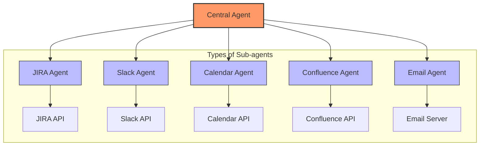
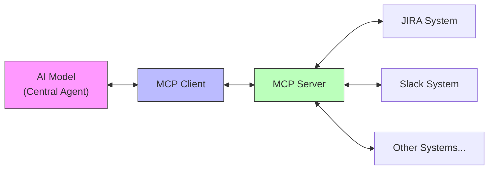
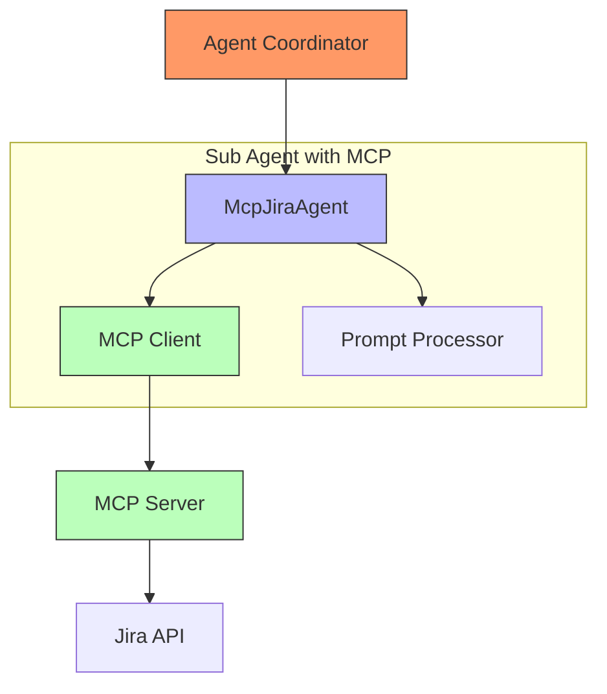
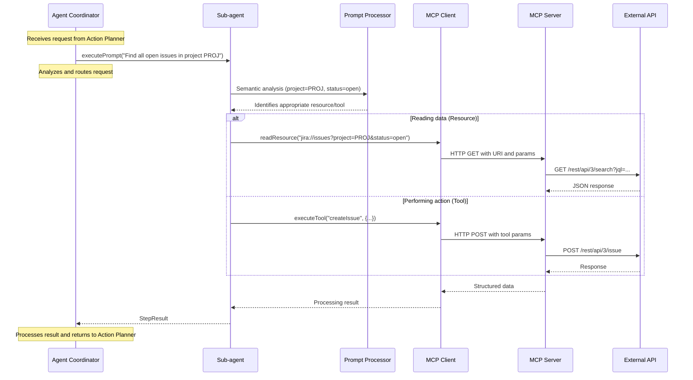
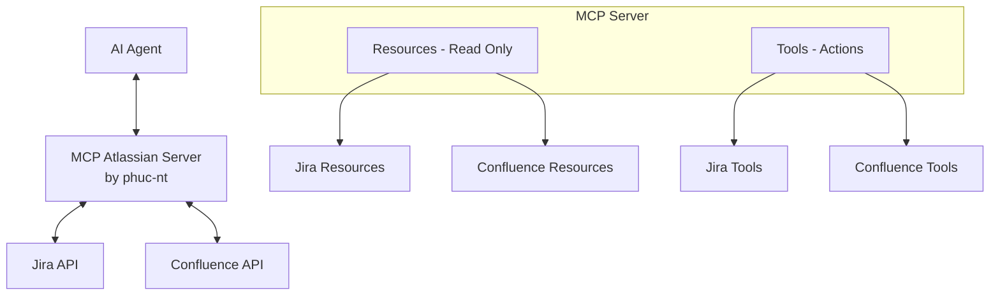

# AI Agent Development Guide - Part 3: Deep Dive into Sub-agents and MCP

> **Guide for AI Agent developers at the company.**
>
> This documentation consists of 3 parts:
> - [Part 1: Overall Architecture](./ai_agent_development_guide_part1.md)
> - [Part 2: Central Agent Internal Details](./ai_agent_development_guide_part2.md)
> - [Part 3: Deep Dive into Sub-agents and MCP](./ai_agent_development_guide_part3.md) (this document)

## Introduction

In [Part 1](./ai_agent_development_guide_part1.md) and [Part 2](./ai_agent_development_guide_part2.md), we explored the overall architecture of the Central-Sub Agent system and the internal workings of the Central Agent. Part 3 will delve into the "bottom layer" of the system—where Sub-agents interact directly with the outside world.

This section focuses on how to effectively implement Sub-agents, especially how to use the Model Context Protocol (MCP) to create flexible, powerful, and secure Sub-agents.

## 1. Sub-agents in Agent Architecture

### 1.1 Role of Sub-agents

Sub-agents are specialized components in the AI Agent system, each responsible for a specific task and interacting with a particular external system. You can think of Sub-agents as "experts" coordinated by the Central Agent to accomplish complex tasks.



### 1.2 Characteristics of Sub-agents

Each ideal Sub-agent should meet the following characteristics:

1. **Specialization**: Focused on a specific domain (Jira, Slack, Calendar...)
2. **Consistent interface**: Provides a standardized interface for easy coordination by the Central Agent
3. **Error handling capability**: Ensures handling of exceptions from external APIs
4. **Interpretation capability**: Converts between natural language and specific API requests
5. **Access control**: Ensures safety when interacting with external systems

### 1.3 Sub-agent Implementation Methods

There are several ways to implement Sub-agents, each with its own pros and cons:

| Method | Description | Advantages | Disadvantages |
|--------|-------------|------------|---------------|
| **Direct** | Sub-agent directly calls external API | Simple, high control | Dependent on API structure, hard to maintain |
| **SDK/Library** | Uses available library to call API | Leverages tested code, saves time | Dependent on third-party library updates |
| **Function Calling** | Defines functions and lets LLM decide how to call | Flexible, easy to extend | May be inaccurate, hard to control |
| **MCP (Model Context Protocol)** | Standard protocol for AI to interact with external systems | Standardized, secure, flexible | Requires MCP server implementation |

## 2. Model Context Protocol (MCP)

### 2.1 What is MCP?

Model Context Protocol (MCP) is an open protocol that allows AI models to interact with external data sources and systems in a standardized way. MCP solves a critical challenge: how can AI safely and efficiently access and interact with real-world data and functions.



MCP provides a structured framework to:
- Query data from various sources
- Perform actions on external systems
- Ensure consistency in interactions between AI and systems

### 2.2 Main Components of MCP

The MCP ecosystem includes the following main components:

1. **MCP Client**: Library that allows AI to interact with MCP Server
2. **MCP Server**: Bridge connecting AI requests to backend systems
3. **Transports**: Communication channels between client and server (STDIO, HTTP/SSE, WebSockets)

### 2.3 Core Concepts in MCP

#### 2.3.1 Resources

Resources are the main means for AI to access data in MCP. They are data entities that can be addressed via URI.

```
jira://issues            - List of all issues
jira://issues/PROJ-123   - Details of a specific issue
```

**Characteristics of resources:**
- **Read-only**: Used for querying/reading data, does not change state
- **Structured**: Returned data has consistent structure
- **Filterable**: Usually supports query parameters to filter results

#### 2.3.2 Tools

Tools are functions that allow AI to perform actions that change the system state. Tools are like functions with parameters and return results.

```typescript
// Example tool definition in MCP
{
  name: "createIssue",
  description: "Create a new issue in Jira",
  input: {
    projectKey: "string", // Project key
    summary: "string",    // Issue summary
    description: "string" // Issue description
  }
}
```

**Characteristics of tools:**
- **State-changing**: Used to create, update, or delete data
- **Has parameters**: Requires specific, validated input
- **Returns results**: Notifies the result of the performed action

### 2.4 MCP vs. Function Calling

| Aspect | MCP | Function Calling |
|--------|-----|------------------|
| **Standardization** | Standard protocol, consistent across applications | Depends on specific implementation |
| **Data types** | Resources and Tools | Functions with input/output |
| **Interaction** | Two-way, supports streaming | Usually one-off call |
| **Scope** | Designed as an open, cross-platform protocol | Usually tied to a specific LLM |
| **Security** | Supports access control and limits | Depends on implementation |

## 3. Implementing Sub-agents with MCP

### 3.1 Sub-agent Architecture and Communication Process with MCP

MCP Sub-agents are built with a standardized architecture that simultaneously allows separation of processing logic and simplification of API interactions. Below are two diagrams illustrating both the static structure and dynamic communication flow during request processing.



Each component in the system has a clearly defined role:

- **Agent Coordinator**: Routes requests to the appropriate specialized Sub-agent
- **Prompt Processor**: Converts natural language into intents and entities
- **MCP Client**: Connects and sends requests to MCP Server according to MCP standards
- **MCP Server**: Transforms MCP requests into corresponding API calls

The processing flow of a request is detailed in the following sequence diagram:



Key features of the MCP Sub-agent architecture:

1. **Language transformation**: Automatically analyzes natural language requests into MCP commands
2. **Separation of concerns**: Sub-agent logic is separated from API details
3. **Interface standardization**: Unified communication protocol between systems
4. **Read/write support**: Simultaneously supports data querying and action performance
5. **Security**: Precise access control down to individual resources/tools

### 3.2 Benefits of MCP-based Sub-agents

1. **Separation of concerns**: MCP separates Sub-agent logic from API connection details
2. **Consistent interface**: Sub-agents have a unified interface regardless of external system
3. **Scalability**: Easily add new resources/tools without affecting Central Agent
4. **Higher security**: Precisely control data and actions AI can perform
5. **Reusability**: MCP Server can be used by multiple AI applications


## 4. MCP Atlassian Server

### 4.1 Introduction

**[MCP Atlassian Server (by phuc-nt)](https://github.com/phuc-nt/mcp-atlassian-server)** is a full implementation of an MCP server for Atlassian systems, designed to be immediately compatible with many AI Agents supporting MCP client such as Cline, GitHub Copilot, and Claude.

This server acts as a bridge between AI Agents and Atlassian systems (Jira & Confluence), allowing:
- Querying data via clearly structured resources
- Performing actions via precisely defined tools
- Safe interaction between AI and Atlassian systems

Outstanding features:
- **Ready to use**: No need to develop MCP server from scratch
- **Wide compatibility**: Works with any AI Agent supporting MCP protocol
- **Proven**: Tested on many real-world systems
- **Comprehensive**: Includes over 38 resources and 24 tools for Jira and Confluence
- **Secure**: Strict access control and authentication system

> **Tip for learners**: If you want to deeply understand MCP, try [MCP Atlassian Server (by phuc-nt)](https://github.com/phuc-nt/mcp-atlassian-server). This is the most effective way to master both MCP theory and practice.

#### Integration architecture:



To start using in Auto Workflow Agent, you need to:
1. Install [MCP Atlassian Server (by phuc-nt)](https://github.com/phuc-nt/mcp-atlassian-server): `npm install @phuc-nt/mcp-atlassian-server`
2. Install MCP Client SDK: `npm install @modelcontextprotocol/sdk`
3. Configure connection to Atlassian via environment variables or config file
4. Create MCP Agent connecting MCP Client and Central Agent

> **Security principle**: Agents can only perform actions within the scope of permissions granted via token. Carefully consider when granting permissions to AI Agents.

### 4.2 Detailed Integration Guide

> **Note**: The detailed integration guide will be added after the release of AWA (Auto Workflow Agent), an internal AI Agent platform designed to fully leverage MCP capabilities in the enterprise.

**COMING SOON !!!**

In the meantime, developers can:

1. **Explore [MCP Atlassian Server (by phuc-nt)](https://github.com/phuc-nt/mcp-atlassian-server)** - Learn about available resources and tools
2. **Refer to MCP documentation** - To better understand the protocol and implementation
3. **Experiment with existing AI Agents** - Use with Cline or Github Copilot

### 4.3 Benefits and Applications

[MCP Atlassian Server (by phuc-nt)](https://github.com/phuc-nt/mcp-atlassian-server) brings significant value to AI Agents:

| Aspect | Benefit |
|--------|---------|
| **Technical** | • MCP standard compliance<br>• Fast deployment<br>• Easy maintenance<br>• Better security |
| **Business** | • Increased project management productivity<br>• Reduced interaction errors<br>• Saves development time |
| **Experience** | • Natural language interface<br>• Seamless interaction with Atlassian |

#### Typical use cases

- **Agile management**: Automate issue creation, sprint updates, progress reporting
- **Knowledge management**: Create, query, and update Confluence documents
- **Development assistant**: Support engineering teams with daily Jira tasks
- **Data analysis**: Aggregate information from multiple Atlassian sources

## 5. Summary and Prospects

MCP opens a new era in building flexible AI Agents, enabling safe and efficient interaction with many enterprise systems.

### 5.1 Development Trends

| Direction | Brief Description |
|-----------|------------------|
| **Ecosystem expansion** | Develop MCP Server for other services like GitHub, Slack, Mail, Calendar... |
| **Advanced AI Agents** | Integrate Agentic-RAG and self-learning mechanisms to improve efficiency |
| **Diverse Sub-agents** | Specialized Sub-agents, ability to combine and operate across platforms |

### 5.2 Conclusion

[MCP Atlassian Server (by phuc-nt)](https://github.com/phuc-nt/mcp-atlassian-server) is proof of MCP's potential, laying the foundation for a comprehensive AI Agent ecosystem. This standardization helps AI Agents not only interact effectively with external systems but also collaborate, unlocking powerful applications in enterprise environments.

---

> "The power of MCP lies not only in connecting AI with external systems, but also in creating a common standard so that different AI Agents can work together as a comprehensive ecosystem, expanding the capabilities of modern AI systems."

---

*Last updated: May, 2025*
