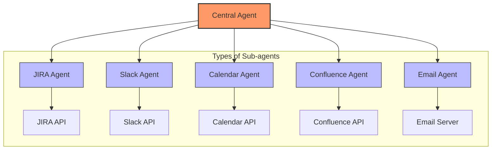
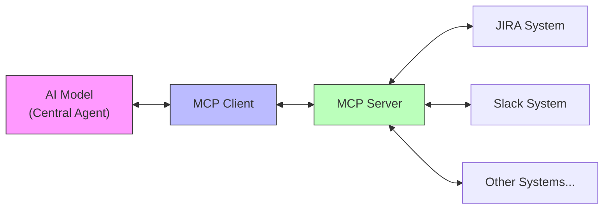
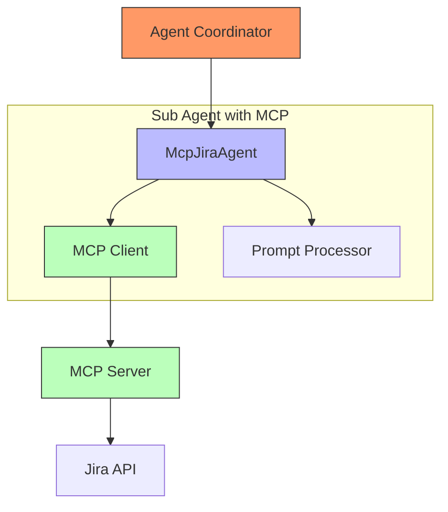
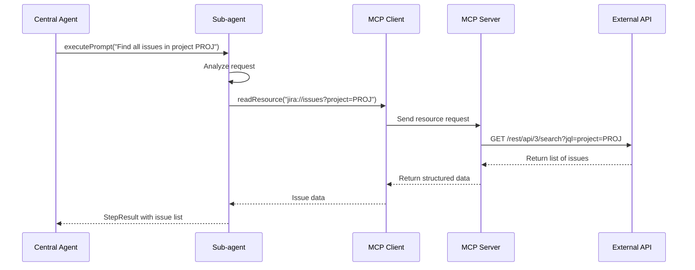
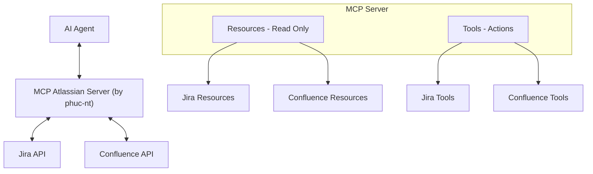

# AI Agent Development Guide - Part 3: Deep Dive into Sub-agents and MCP

> **This guide is for engineers developing AI Agents at the company.**
>
> This documentation consists of 3 parts:
> - [Part 1: Overall Architecture](./ai_agent_development_guide_part1.md)
> - [Part 2: Inside the Central Agent](./ai_agent_development_guide_part2.md)
> - [Part 3: Deep Dive into Sub-agents and MCP](./ai_agent_development_guide_part3.md) (this document)

## Introduction

In [Part 1](./ai_agent_development_guide_part1.md) and [Part 2](./ai_agent_development_guide_part2.md), we explored the overall architecture of the Central-Sub Agent system and the details of the Central Agent's operation. Part 3 delves into the "bottom layer" of the system—where Sub-agents interact directly with the outside world.

This section focuses on how to implement Sub-agents effectively, especially how to use the Model Context Protocol (MCP) to create flexible, powerful, and secure Sub-agents.

## 1. Sub-agents in Agent Architecture

### 1.1 Role of Sub-agents

Sub-agents are specialized components in the AI Agent system, each responsible for a specific task and interacting with a particular external system. You can think of Sub-agents as "experts" coordinated by the Central Agent to accomplish complex tasks.



### 1.2 Characteristics of Sub-agents

An ideal Sub-agent should have the following characteristics:

1. **Specialization**: Focused on a specific domain (Jira, Slack, Calendar, etc.)
2. **Consistent Interface**: Provides a standardized interface for easy coordination by the Central Agent
3. **Error Handling**: Ensures handling of exceptions from external APIs
4. **Interpretation Ability**: Translates between natural language and specific API requests
5. **Access Control**: Ensures safety when interacting with external systems

### 1.3 Sub-agent Implementation Methods

There are several ways to implement Sub-agents, each with its own pros and cons:

| Method | Description | Advantages | Disadvantages |
|--------|-------------|------------|---------------|
| **Direct** | Sub-agent calls external API directly | Simple, high control | Dependent on API structure, hard to maintain |
| **SDK/Library** | Uses available libraries to call API | Leverages tested code, saves time | Dependent on third-party library updates |
| **Function Calling** | Defines functions and lets LLM decide how to call | Flexible, easy to extend | May be inaccurate, hard to control |
| **MCP (Model Context Protocol)** | Standard protocol for AI to interact with external systems | Standardized, secure, flexible | Requires MCP server implementation |

## 2. Model Context Protocol (MCP)

### 2.1 What is MCP?

Model Context Protocol (MCP) is an open protocol that allows AI models to interact with external data sources and systems in a standardized way. MCP solves a key challenge: how can AI safely and efficiently access and interact with real-world data and functions.



MCP provides a structured framework to:
- Query data from multiple sources
- Perform actions on external systems
- Ensure consistency in interactions between AI and external systems

### 2.2 Why MCP?

MCP is designed to address common challenges in AI and external system integration:

- **Standardization**: A consistent way for AI to communicate with any external system
- **Security**: Safe access to external data and functions, with fine-grained control
- **Flexibility**: Easily adaptable to different APIs and data sources
- **Efficiency**: Optimized for performance, reducing latency in AI responses

### 2.3 Core Concepts in MCP

#### 2.3.1 Resources

Resources are the main way for AI to access data in MCP. They are data entities addressable via URI.

```
jira://issues            - List of all issues
jira://issues/PROJ-123   - Details of a specific issue
```

**Characteristics of resources:**
- **Read-only**: Used for querying/reading data, does not change state
- **Structured**: Returned data has a consistent structure
- **Filterable**: Often supports query parameters to filter results

#### 2.3.2 Tools

Tools are functions that allow AI to perform actions that change the system state. Tools are like functions with parameters and return results.

```typescript
// Example tool definition in MCP
{
  name: "createIssue",
  description: "Create a new issue in Jira",
  input: {
    projectKey: "string", // Project key
    summary: "string",    // Issue title
    description: "string" // Issue description
  }
}
```

**Characteristics of tools:**
- **State-changing**: Used to create, update, or delete data
- **Has parameters**: Requires specific validated input
- **Returns results**: Notifies the outcome of the action

### 2.4 MCP vs. Function Calling

| Aspect | MCP | Function Calling |
|--------|-----|------------------|
| **Standardization** | Consistent protocol | Implementation-dependent |
| **Data Types** | Resources and Tools | Function input/output |
| **Interaction** | Bidirectional, supports streaming | Usually one-off calls |
| **Scope** | Designed as an open, cross-platform protocol | Often tied to a specific LLM |
| **Security** | Access control and restrictions | Implementation-dependent |

## 3. Implementing Sub-agents with MCP

### 3.1 Sub-agent Architecture with MCP



Key features of this architecture:
1. Agent Coordinator calls Sub-agent with a natural language command
2. Sub-agent uses Prompt Processor to analyze the request
3. Sub-agent determines which MCP resource/tool to call
4. MCP Client sends the request to MCP Server
5. MCP Server interacts with the real API
6. Results are returned in reverse order

### 3.2 Benefits of MCP-based Sub-agents

1. **Separation of concerns**: MCP separates Sub-agent logic from API connection details
2. **Consistent interface**: Sub-agents have a unified interface regardless of external systems
3. **Scalability**: Easily add new resources/tools without affecting the Central Agent
4. **Higher security**: Precisely control data and actions AI can perform
5. **Reusability**: MCP Server can be used by multiple AI applications

### 3.3 MCP Sub-agent Communication Flow



This flow shows how MCP converts natural language requests into specific API calls, and vice versa, converting API results into structured data that AI can understand.

## 4. MCP Atlassian Server

### 4.1 Overview

**[MCP Atlassian Server (by phuc-nt)](https://github.com/phuc-nt/mcp-atlassian-server)** is a full implementation of an MCP server for Atlassian systems, designed to be immediately compatible with many AI Agents supporting MCP clients such as Cline, GitHub Copilot, and Claude.

Key features:
- **Ready to use**: No need to develop an MCP server from scratch
- **Wide compatibility**: Works with any AI Agent supporting the MCP protocol
- **Proven**: Tested on real systems
- **Comprehensive**: Provides over 38 resources and 24 tools for Jira and Confluence
- **Security**: Strict authentication and permission management

> **Tip for learners**: If you want to deeply understand MCP, try [MCP Atlassian Server (by phuc-nt)](https://github.com/phuc-nt/mcp-atlassian-server). It's the best way to learn both theory and practice at once.

#### Example Integration Architecture



Getting started:
1. Install [MCP Atlassian Server (by phuc-nt)](https://github.com/phuc-nt/mcp-atlassian-server): `npm install @phuc-nt/mcp-atlassian-server`
2. Install MCP Client SDK: `npm install @modelcontextprotocol/sdk`
3. Configure Atlassian connection (via environment variables or config file)
4. Create an MCP Agent connecting MCP Client and Central Agent

> **Security principle**: The AI Agent can only perform actions within the scope granted by the token. Be careful when granting permissions.

### 4.2 Integration Guide (Coming Soon)

> **Note**: Detailed integration instructions will be added after the release of AWA (Auto Workflow Agent), an in-house AI Agent platform to fully leverage MCP in the enterprise.

**COMING SOON !!!**

In the meantime, developers can:

1. **Explore [MCP Atlassian Server (by phuc-nt)](https://github.com/phuc-nt/mcp-atlassian-server)** – Learn about available resources and tools
2. **Refer to MCP documentation** – To better understand the protocol and implementation
3. **Experiment with existing AI Agents** – Use with Cline or GitHub Copilot

### 4.3 Benefits and Use Cases

[MCP Atlassian Server (by phuc-nt)](https://github.com/phuc-nt/mcp-atlassian-server) brings significant value to AI Agents:

| Aspect | Benefit |
|--------|---------|
| **Technical** | • MCP standard compliant<br>• Quick deployment<br>• Easy maintenance<br>• Enhanced security |
| **Business** | • Increased project management productivity<br>• Reduced operational errors<br>• Saved development time |
| **Experience** | • Natural language interface<br>• Seamless integration with Atlassian |

#### Typical Use Cases

- **Agile management**: Automate issue creation, sprint updates, and progress reporting
- **Knowledge management**: Create, query, and update Confluence documents
- **Development support**: Automate daily Jira tasks
- **Data analysis**: Aggregate information from multiple Atlassian sources

## 5. Summary and Outlook

MCP opens a new era for building flexible AI Agents, enabling safe and efficient integration with various enterprise systems.

### 5.1 Future Directions

| Direction | Brief Description |
|-----------|-------------------|
| **Ecosystem Expansion** | Develop MCP Servers for other services like GitHub, Slack, Mail, Calendar, etc. |
| **Advanced AI Agents** | Integrate Agentic-RAG and self-learning mechanisms to improve efficiency |
| **Diverse Sub-agents** | Specialized, composable, and cross-platform sub-agents |

### 5.2 Conclusion

[MCP Atlassian Server (by phuc-nt)](https://github.com/phuc-nt/mcp-atlassian-server) is a prime example of MCP's potential, laying the foundation for a comprehensive AI Agent ecosystem. This standardization enables AI Agents not only to interact efficiently with external systems but also to collaborate, unlocking powerful applications in enterprise environments.

---

> "The strength of MCP lies not only in connecting AI to external systems, but also in providing a common standard for different AI Agents to work together as a comprehensive ecosystem, expanding the capabilities of modern AI systems."

---

*Last updated: May 2025*
