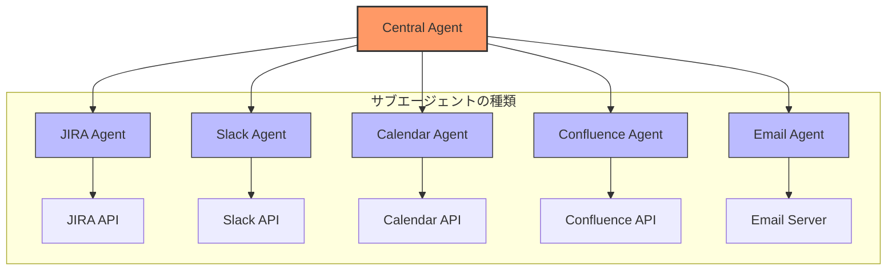
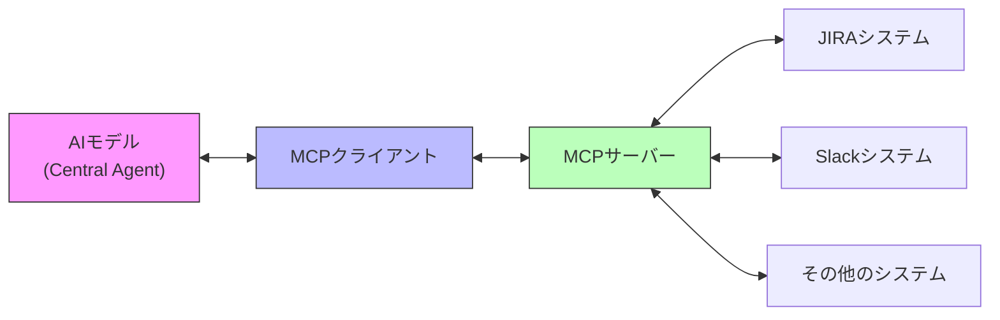
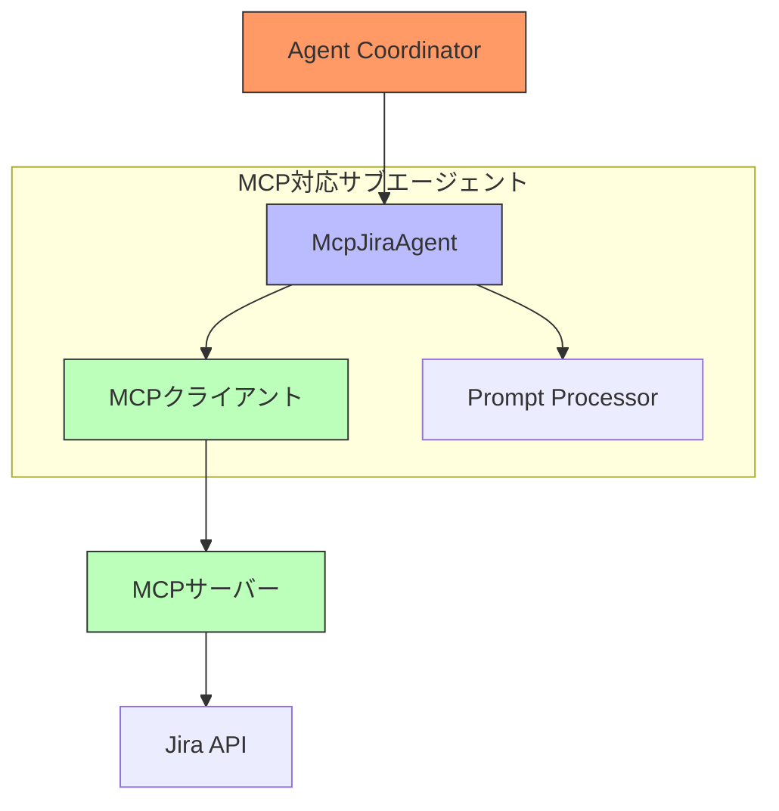
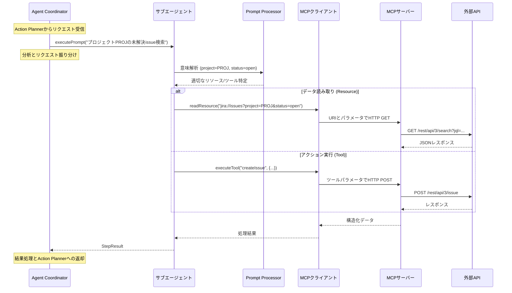
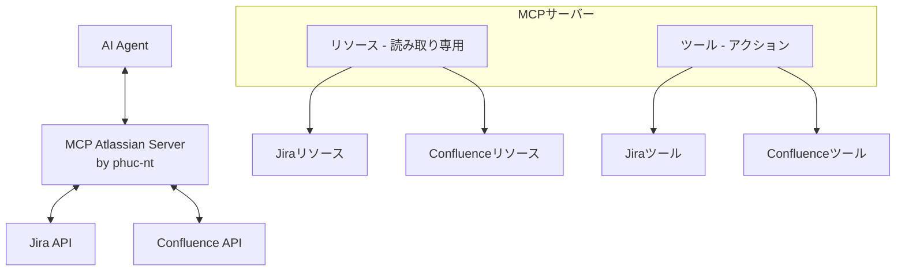

# AIエージェント開発ガイド - パート3：サブエージェントとMCPの深掘り

> **社内AIエージェント開発者向けガイド。**
>
> 本ドキュメントは3部構成です：
> - [パート1：全体アーキテクチャ](./ai_agent_development_guide_part1.md)
> - [パート2：Central Agentの内部詳細](./ai_agent_development_guide_part2.md)
> - [パート3：サブエージェントとMCPの深掘り](./ai_agent_development_guide_part3.md)（本ドキュメント）

## はじめに

[パート1](./ai_agent_development_guide_part1.md)と[パート2](./ai_agent_development_guide_part2.md)では、Central-Sub Agentシステムの全体アーキテクチャとCentral Agentの内部動作について説明しました。パート3では、システムの「最下層」—サブエージェントが外部世界と直接やり取りする部分—に焦点を当てます。

本パートでは、サブエージェントを効果的に実装する方法、特にModel Context Protocol（MCP）を活用して柔軟で強力かつ安全なサブエージェントを作る方法を解説します。

## 1. エージェントアーキテクチャにおけるサブエージェント

### 1.1 サブエージェントの役割

サブエージェントはAIエージェントシステム内の専門的なコンポーネントであり、それぞれが特定のタスクを担当し、特定の外部システムとやり取りします。サブエージェントは、Central Agentが調整する「専門家」と考えることができます。



### 1.2 サブエージェントの特徴

理想的なサブエージェントは以下の特徴を備える必要があります：

1. **専門性**：特定のドメイン（Jira、Slack、Calendarなど）に特化
2. **一貫したインターフェース**：Central Agentが容易に調整できる標準化されたインターフェースを提供
3. **エラー処理能力**：外部APIからの例外を確実に処理
4. **解釈能力**：自然言語と特定APIリクエストの変換
5. **アクセス制御**：外部システムとのやり取り時の安全性を確保

### 1.3 サブエージェントの実装方法

サブエージェントの実装方法はいくつかあり、それぞれに長所と短所があります：

| 方法 | 説明 | 長所 | 短所 |
|------|------|------|------|
| **直接** | サブエージェントが外部APIを直接呼び出す | シンプル、高い制御性 | API構造に依存、保守が困難 |
| **SDK/ライブラリ** | 既存ライブラリを利用してAPIを呼び出す | テスト済みコードの活用、時間短縮 | サードパーティライブラリの更新に依存 |
| **Function Calling** | 関数を定義し、LLMが呼び出し方法を決定 | 柔軟、拡張が容易 | 精度に欠ける場合があり、制御が難しい |
| **MCP（Model Context Protocol）** | AIが外部システムとやり取りするための標準プロトコル | 標準化、安全、柔軟 | MCPサーバーの実装が必要 |

## 2. Model Context Protocol（MCP）

### 2.1 MCPとは

Model Context Protocol（MCP）は、AIモデルが外部データソースやシステムと標準化された方法でやり取りできるようにするオープンプロトコルです。MCPは、AIが現実世界のデータや機能に安全かつ効率的にアクセス・操作するという重要な課題を解決します。



MCPは以下を実現するための構造化フレームワークを提供します：
- 様々なソースからのデータクエリ
- 外部システムへのアクション実行
- AIとシステム間のやり取りの一貫性確保

### 2.2 MCPの主な構成要素

MCPエコシステムは以下の主要コンポーネントで構成されます：

1. **MCPクライアント**：AIがMCPサーバーとやり取りするためのライブラリ
2. **MCPサーバー**：AIリクエストをバックエンドシステムに橋渡し
3. **トランスポート**：クライアントとサーバー間の通信チャネル（STDIO、HTTP/SSE、WebSockets）

### 2.3 MCPのコア概念

#### 2.3.1 リソース

リソースは、AIがMCPでデータにアクセスするための主要な手段です。URIでアドレス指定可能なデータエンティティです。

```
jira://issues            - すべてのissue一覧
jira://issues/PROJ-123   - 特定issueの詳細
```

**リソースの特徴：**
- **読み取り専用**：データのクエリ/取得専用、状態変更なし
- **構造化**：返却データは一貫した構造
- **フィルタ可能**：多くの場合、クエリパラメータで結果を絞り込み可能

#### 2.3.2 ツール

ツールは、AIがシステムの状態を変更するアクションを実行するための関数です。ツールはパラメータ付きの関数のようなものです。

```typescript
// MCPでのツール定義例
{
  name: "createIssue",
  description: "Jiraで新しいissueを作成",
  input: {
    projectKey: "string", // プロジェクトキー
    summary: "string",    // issueタイトル
    description: "string" // issue説明
  }
}
```

**ツールの特徴：**
- **状態変更**：データの作成・更新・削除に使用
- **パラメータあり**：特定の入力が必要で、バリデーションされる
- **結果返却**：実行結果を通知

### 2.4 MCPとFunction Callingの比較

| 観点 | MCP | Function Calling |
|------|-----|------------------|
| **標準化** | 標準プロトコル、アプリ間で一貫 | 実装ごとに異なる |
| **データ型** | リソースとツール | 入出力付き関数 |
| **やり取り** | 双方向、ストリーミング対応 | 通常は単発呼び出し |
| **スコープ** | オープンでクロスプラットフォーム | 特定LLMに紐づく場合が多い |
| **セキュリティ** | アクセス制御・制限に対応 | 実装依存 |

## 3. MCPを用いたサブエージェントの実装

### 3.1 MCPサブエージェントのアーキテクチャと通信プロセス

MCPサブエージェントは、処理ロジックの分離とAPI操作の簡素化を同時に実現する標準化されたアーキテクチャで構築されています。以下は、リクエスト処理中の静的構造と動的通信フローの両方を示す2つの図です。



システム内の各コンポーネントには明確な役割があります：

- **Agent Coordinator**: リクエストを適切な専門サブエージェントに振り分け
- **Prompt Processor**: 自然言語を意図とエンティティに変換
- **MCP Client**: MCP標準に従ってMCPサーバーに接続・リクエスト送信
- **MCP Server**: MCPリクエストを対応するAPI呼び出しに変換

リクエストの処理フローは次のシーケンス図で詳細に示されています：



MCPサブエージェントアーキテクチャの主な特徴：

1. **言語変換**: 自然言語リクエストを自動的にMCPコマンドに分析
2. **関心の分離**: サブエージェントロジックをAPI詳細から切り離し
3. **インターフェース標準化**: システム間の通信プロトコル統一
4. **読み書き対応**: データクエリとアクション実行の両方を同時にサポート
5. **セキュリティ**: 個々のリソース/ツールレベルまでの精密なアクセス制御

### 3.2 MCPベースサブエージェントの利点

1. **関心の分離**：MCPによりサブエージェントのロジックとAPI接続の詳細が分離
2. **一貫したインターフェース**：外部システムに関わらず統一されたインターフェース
3. **拡張性**：Central Agentに影響なく新しいリソース/ツールを追加可能
4. **高いセキュリティ**：AIが実行できるデータ・アクションを厳密に制御
5. **再利用性**：MCPサーバーは複数AIアプリで利用可能


## 4. MCP Atlassian Server

### 4.1 概要

**[MCP Atlassian Server (by phuc-nt)](https://github.com/phuc-nt/mcp-atlassian-server)**は、Atlassianシステム向けのMCPサーバーの完全実装であり、Cline、GitHub Copilot、ClaudeなどMCPクライアント対応AIエージェントと即座に互換性があります。

このサーバーはAIエージェントとAtlassianシステム（Jira & Confluence）の橋渡し役を担い、
- 明確な構造のリソースによるデータクエリ
- 正確に定義されたツールによるアクション実行
- AIとAtlassianシステム間の安全なやり取り
を実現します。

主な特徴：
- **すぐに利用可能**：MCPサーバーを一から開発する必要なし
- **幅広い互換性**：MCPプロトコル対応AIエージェントなら何でも利用可能
- **実績あり**：多くの実システムで検証済み
- **包括的**：JiraとConfluence向けに38以上のリソース、24以上のツールを搭載
- **高セキュリティ**：厳格なアクセス制御と認証システム

> **学習者へのアドバイス**：MCPを深く理解したい場合は、[MCP Atlassian Server (by phuc-nt)](https://github.com/phuc-nt/mcp-atlassian-server)をぜひ体験してください。理論と実践の両方をマスターする最良の方法です。

#### 統合アーキテクチャ：



Auto Workflow Agentで利用を開始するには：
1. [MCP Atlassian Server (by phuc-nt)](https://github.com/phuc-nt/mcp-atlassian-server)をインストール：`npm install @phuc-nt/mcp-atlassian-server`
2. MCPクライアントSDKをインストール：`npm install @modelcontextprotocol/sdk`
3. 環境変数または設定ファイルでAtlassian接続を設定
4. MCPクライアントとCentral Agentを接続するMCPエージェントを作成

> **セキュリティ原則**：エージェントはトークンで付与された権限範囲内でのみアクションを実行可能です。AIエージェントに権限を与える際は慎重に検討してください。

### 4.2 詳細な統合ガイド

> **注意**：詳細な統合ガイドは、MCPの全機能を活用する社内AIエージェント基盤「AWA（Auto Workflow Agent）」リリース後に追加予定です。

**COMING SOON !!!**

それまでの間、開発者は：

1. **[MCP Atlassian Server (by phuc-nt)](https://github.com/phuc-nt/mcp-atlassian-server)を探索**—利用可能なリソースやツールを学ぶ
2. **MCPドキュメントを参照**—プロトコルや実装方法を理解
3. **既存AIエージェントで試す**—ClineやGithub Copilotで利用

### 4.3 利点と応用

[MCP Atlassian Server (by phuc-nt)](https://github.com/phuc-nt/mcp-atlassian-server)はAIエージェントに多くの価値をもたらします：

| 観点 | 利点 |
|------|------|
| **技術** | • MCP標準準拠<br>• 迅速な導入<br>• 保守容易<br>• 高セキュリティ |
| **ビジネス** | • プロジェクト管理の生産性向上<br>• やり取りミスの削減<br>• 開発時間の短縮 |
| **体験** | • 自然言語インターフェース<br>• Atlassianとのシームレスな連携 |

#### 代表的なユースケース

- **アジャイル管理**：issue作成、スプリント更新、進捗報告の自動化
- **ナレッジ管理**：Confluenceドキュメントの作成・検索・更新
- **開発アシスタント**：Jiraの日常タスクを技術チームが効率化
- **データ分析**：複数Atlassianソースから情報集約

## 5. まとめと展望

MCPは柔軟なAIエージェント構築の新時代を切り開き、多くの企業システムと安全かつ効率的に連携可能にします。

### 5.1 今後の発展トレンド

| 方向性 | 概要 |
|--------|------|
| **エコシステム拡大** | GitHub、Slack、Mail、Calendarなど他サービス向けMCPサーバー開発 |
| **高度なAIエージェント** | Agentic-RAGや自己学習機構の統合で効率向上 |
| **多様なサブエージェント** | 専門サブエージェントの連携・クロスプラットフォーム運用 |

### 5.2 結論

[MCP Atlassian Server (by phuc-nt)](https://github.com/phuc-nt/mcp-atlassian-server)はMCPの可能性を示す好例であり、包括的なAIエージェントエコシステムの基盤となります。この標準化により、AIエージェントは外部システムと効果的に連携するだけでなく、相互に協調し、企業環境で強力な応用を実現します。

---

> 「MCPの強みは、AIと外部システムをつなぐだけでなく、異なるAIエージェント同士が包括的なエコシステムとして協調できる共通標準を作ることにあります。これにより現代AIシステムの可能性が大きく広がります。」

---

*最終更新：2025年5月*
