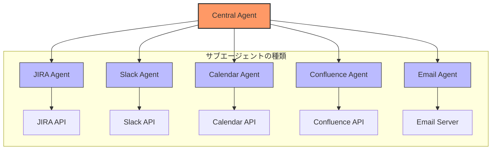
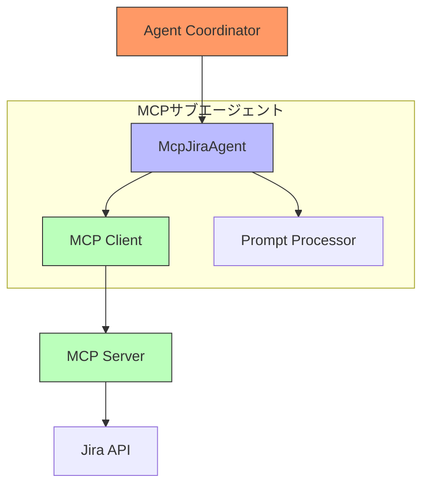
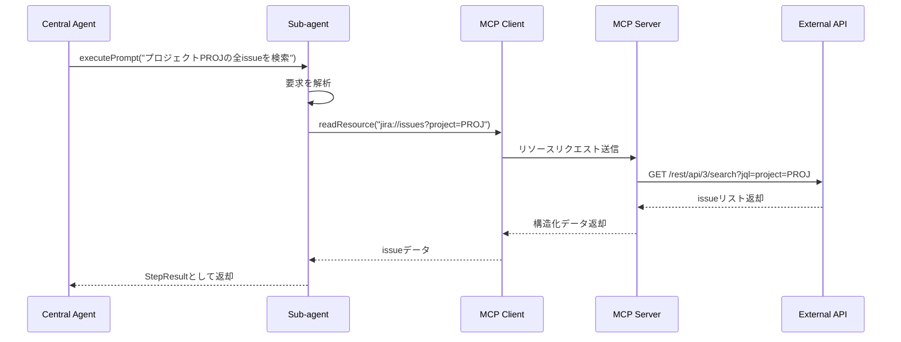
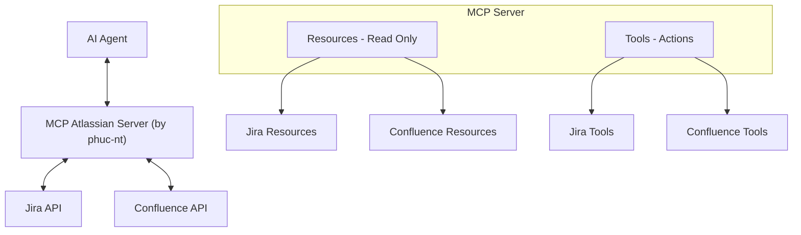

# AIエージェント開発ガイド - パート3: サブエージェントとMCPの深掘り

> **本ガイドは、社内でAIエージェントを開発するエンジニア向けの資料です。**
>
> 本ドキュメントは3部構成です：
> - [パート1: 全体アーキテクチャ](./ai_agent_development_guide_part1.md)
> - [パート2: セントラルエージェントの詳細](./ai_agent_development_guide_part2.md)
> - [パート3: サブエージェントとMCPの深掘り](./ai_agent_development_guide_part3.md)（本資料）

## はじめに

[パート1](./ai_agent_development_guide_part1.md)と[パート2](./ai_agent_development_guide_part2.md)では、Central-Sub Agentシステムの全体像とCentral Agentの動作詳細を解説しました。パート3では、システムの「最下層」—サブエージェントが外部世界と直接やり取りする部分—に焦点を当てます。

本パートでは、サブエージェントを効果的に実装する方法、特にModel Context Protocol（MCP）を活用して柔軟・強力・安全なサブエージェントを作る方法を解説します。

## 1. エージェントアーキテクチャにおけるサブエージェント

### 1.1 サブエージェントの役割

サブエージェントはAIエージェントシステム内の専門的なコンポーネントであり、それぞれが特定のタスクを担当し、特定の外部システムと連携します。サブエージェントは、Central Agentが複雑なタスクを達成するために調整する「専門家」と考えることができます。



### 1.2 サブエージェントの特徴

理想的なサブエージェントは以下の特徴を備えています：

1. **専門性**：特定のドメイン（Jira、Slack、Calendarなど）に特化
2. **一貫したインターフェース**：Central Agentが容易に連携できる標準化インターフェースを提供
3. **エラー処理**：外部APIからの例外を確実に処理
4. **解釈能力**：自然言語とAPIリクエストの相互変換
5. **アクセス制御**：外部システムとの安全なやり取りを保証

### 1.3 サブエージェントの実装方法

サブエージェントの実装方法はいくつかあり、それぞれに利点と欠点があります：

| 方法 | 説明 | 利点 | 欠点 |
|------|------|------|------|
| **直接** | サブエージェントが外部APIを直接呼び出す | シンプル、高い制御性 | API構造に依存、保守が困難 |
| **SDK/ライブラリ** | 既存ライブラリを利用してAPIを呼び出す | テスト済みコードを活用、開発効率向上 | サードパーティの更新に依存 |
| **Function Calling** | 関数を定義し、LLMが呼び出し方法を決定 | 柔軟、拡張しやすい | 精度や制御が難しい場合あり |
| **MCP（Model Context Protocol）** | AIが外部システムと連携するための標準プロトコル | 標準化、安全、柔軟 | MCPサーバーの実装が必要 |

## 2. Model Context Protocol（MCP）

### 2.1 MCPとは？

Model Context Protocol（MCP）は、AIモデルが外部データソースやシステムと標準化された方法でやり取りできるオープンプロトコルです。MCPは「AIが現実世界のデータや機能に安全かつ効率的にアクセス・連携するには？」という課題を解決します。

```mermaid
flowchart TD
    subgraph "MCPの役割"
        direction TB
        A[AIモデル] -->|MCPメッセージ| B[MCPサーバー]
        B -->|APIコール| C[外部API]
        C -->>|データ| B
        B -->>|MCPレスポンス| A
    end
    
    subgraph "MCPメッセージの流れ"
        direction LR
        D[要求] --> E[リソース/ツール特定]
        E --> F[MCPリクエスト生成]
        F --> G[MCPサーバー送信]
        G --> H[APIリクエスト送信]
        H -->> I[APIレスポンス受信]
        I -->> J[MCPレスポンス生成]
        J -->> K[AIモデルへ返却]
    end
```

この図は、MCPを介してAIモデルと外部システムがどのように連携するかを示しています。

### 2.2 MCPの利点

MCPを使用する主な利点：

- **標準化**：AIと外部システム間のインターフェースが標準化される
- **セキュリティ**：アクセス制御や権限制限により安全性が向上
- **柔軟性**：さまざまな外部システムと連携可能
- **効率性**：データ取得や操作が効率的に行える

### 2.3 MCPのコア概念

#### 2.3.1 リソース（Resources）

リソースは、MCPでAIがデータにアクセスするための主要な手段です。URIでアドレス指定できるデータ実体です。

```
jira://issues            - すべてのissue一覧
jira://issues/PROJ-123   - 特定issueの詳細
```

**リソースの特徴：**
- **読み取り専用**：データの取得・参照のみ、状態変更は不可
- **構造化**：返却データは一貫した構造
- **フィルタリング可能**：クエリパラメータで結果を絞り込める

#### 2.3.2 ツール（Tools）

ツールは、AIがシステムの状態を変更するための機能です。パラメータ付きの関数のようなものです。

```typescript
// MCPでのツール定義例
{
  name: "createIssue",
  description: "Jiraで新しいissueを作成する",
  input: {
    projectKey: "string", // プロジェクトキー
    summary: "string",    // issueタイトル
    description: "string" // issue説明
  }
}
```

**ツールの特徴：**
- **状態変更**：データの作成・更新・削除が可能
- **パラメータ必須**：入力値のバリデーションあり
- **結果返却**：実行結果を返す

### 2.4 MCPとFunction Callingの比較

| 観点 | MCP | Function Calling |
|------|-----|------------------|
| **標準化** | 一貫したプロトコル | 実装依存 |
| **データ型** | リソースとツール | 関数の入出力 |
| **インタラクション** | 双方向・ストリーミング対応 | 単発呼び出しが主 |
| **スコープ** | オープンな標準プロトコル | LLMごとに異なる |
| **セキュリティ** | アクセス制御・権限制限 | 実装依存 |

## 3. MCPを用いたサブエージェントの実装

### 3.1 MCPサブエージェントのアーキテクチャ



このアーキテクチャの特徴：
1. Agent Coordinatorが自然言語でサブエージェントを呼び出す
2. サブエージェントはPrompt Processorで要求を解析
3. 必要なMCPリソース/ツールを特定
4. MCP ClientがMCP Serverにリクエスト送信
5. MCP Serverが実APIと連携
6. 結果が逆順で返却される

### 3.2 MCPベースのサブエージェントの利点

1. **関心の分離**：API接続の詳細をサブエージェントから分離
2. **一貫したインターフェース**：外部システムに依存せず統一的なAPI
3. **拡張性**：新リソース/ツール追加が容易
4. **高いセキュリティ**：AIの操作範囲を厳密に制御
5. **再利用性**：MCP Serverは複数AIアプリで共用可能

### 3.3 MCPサブエージェントの通信フロー



このフローは、MCPが自然言語要求をAPIコールに変換し、API結果をAIが理解できる構造化データに変換する流れを示しています。

## 4. MCP Atlassian Server

### 4.1 概要

**[MCP Atlassian Server (by phuc-nt)](https://github.com/phuc-nt/mcp-atlassian-server)** は、Atlassianシステム向けのMCPサーバー実装例であり、ClineやGitHub CopilotなどMCPクライアント対応AI Agentと即座に連携できます。

主な特徴：
- **すぐに利用可能**：ゼロからMCPサーバーを開発する必要なし
- **幅広い互換性**：MCPプロトコル対応AI Agentならどれでも利用可能
- **実績あり**：実システムでの検証済み
- **多機能**：Jira/Confluence向けに38以上のリソースと24以上のツールを提供
- **セキュリティ**：厳格な認証・権限管理

> **学習者へのアドバイス**：MCPを深く理解したい方は、[MCP Atlassian Server (by phuc-nt)](https://github.com/phuc-nt/mcp-atlassian-server)をぜひ体験してください。理論と実践を同時に学べる最良の方法です。

#### 統合アーキテクチャ例



利用開始手順：
1. [MCP Atlassian Server (by phuc-nt)](https://github.com/phuc-nt/mcp-atlassian-server)のインストール: `npm install @phuc-nt/mcp-atlassian-server`
2. MCP Client SDKのインストール: `npm install @modelcontextprotocol/sdk`
3. Atlassian接続情報の設定（環境変数または設定ファイル）
4. MCP Agentを作成し、MCP ClientとCentral Agentを連携

> **セキュリティ原則**：AI Agentはトークンで許可された範囲内の操作のみ可能。権限付与には十分注意してください。

### 4.2 統合ガイド（準備中）

> **ご注意**：詳細な統合ガイドは、社内向けAI Agent「AWA（Auto Workflow Agent）」リリース後に追記予定です。

**COMING SOON !!!**

それまでの間、開発者は以下を推奨します：

1. **[MCP Atlassian Server (by phuc-nt)](https://github.com/phuc-nt/mcp-atlassian-server)** のリソース・ツールを調査
2. MCPプロトコルのドキュメント参照
3. 既存AI Agent（ClineやGitHub Copilot等）での試験利用

### 4.3 利用メリットとユースケース

[MCP Atlassian Server (by phuc-nt)](https://github.com/phuc-nt/mcp-atlassian-server)は、AI Agentに多くの価値をもたらします：

| 観点 | メリット |
|------|----------|
| **技術** | • MCP標準準拠<br>• 短期間で導入可能<br>• 保守が容易<br>• 高セキュリティ |
| **ビジネス** | • プロジェクト管理の生産性向上<br>• 操作ミス削減<br>• 開発工数削減 |
| **体験** | • 自然言語インターフェース<br>• Atlassianとのシームレスな連携 |

#### 主なユースケース

- **アジャイル管理**：issue作成・スプリント更新・進捗レポートの自動化
- **ナレッジ管理**：Confluenceドキュメントの作成・検索・更新
- **開発支援**：Jira日常業務の自動化
- **データ分析**：複数Atlassianソースからの情報集約

## 5. 総括と展望

MCPは、柔軟なAI Agent構築と多様な業務システムとの安全・効率的な連携を実現する新時代の基盤です。

### 5.1 今後の方向性

| 方向性 | 概要 |
|--------|------|
| **エコシステム拡大** | GitHub、Slack、メール、カレンダー等へのMCP Server展開 |
| **高度なAI Agent** | Agentic-RAGや自己学習機構の統合 |
| **多様なサブエージェント** | 専門特化・連携・マルチプラットフォーム対応 |

### 5.2 結論

[MCP Atlassian Server (by phuc-nt)](https://github.com/phuc-nt/mcp-atlassian-server)は、MCPの可能性を示す好例であり、AI Agentエコシステムの基盤となります。標準化により、AI Agent同士の連携や外部システムとの統合が容易になり、企業内での活用範囲が大きく広がります。

---

> 「MCPの強みは、AIと外部システムの接続だけでなく、異なるAI Agent同士が一つのエコシステムとして協調できる共通基盤を提供する点にあります。」

---

*最終更新日: 2025年5月*
