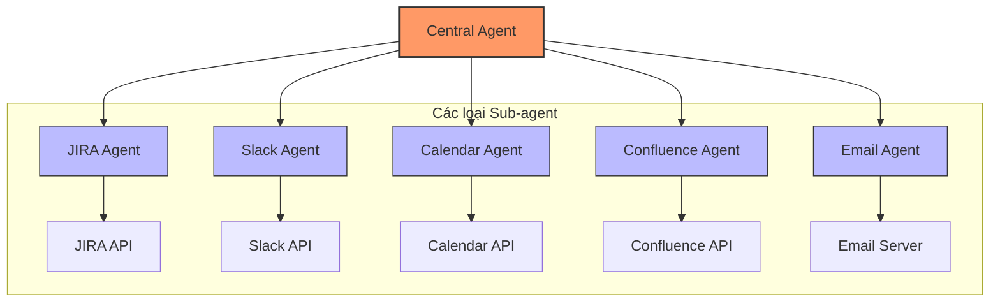
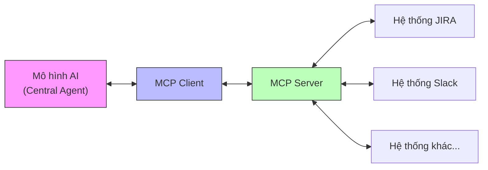
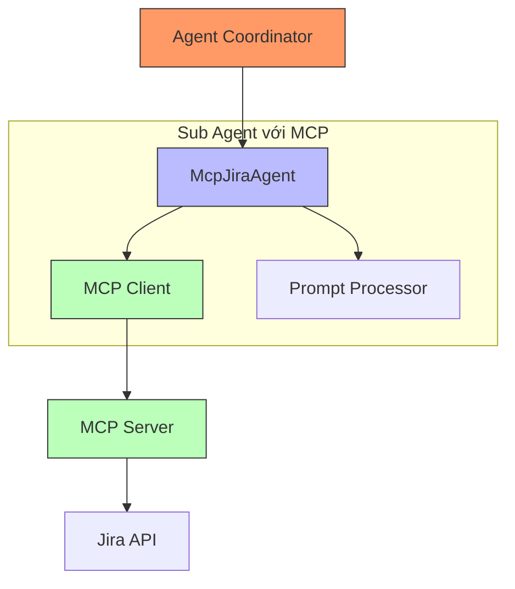
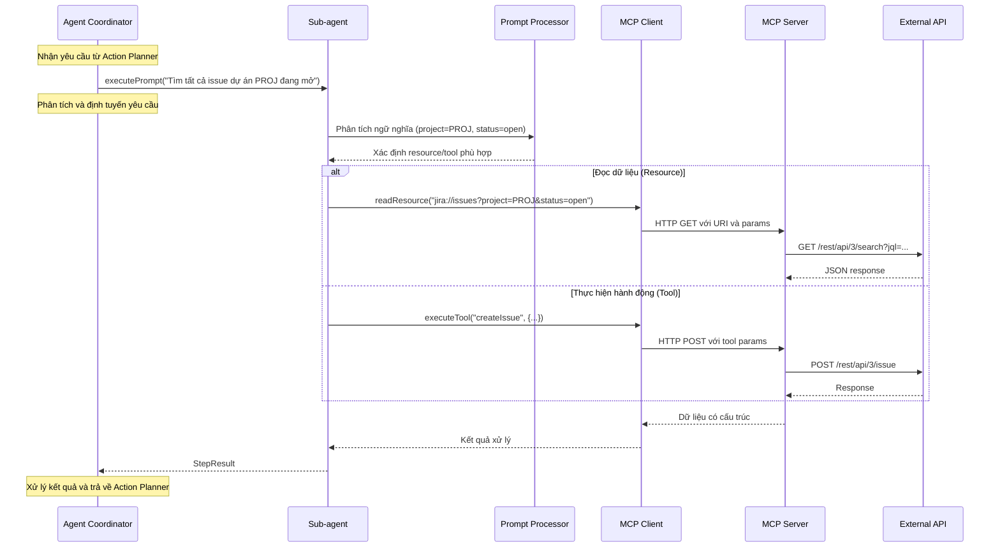
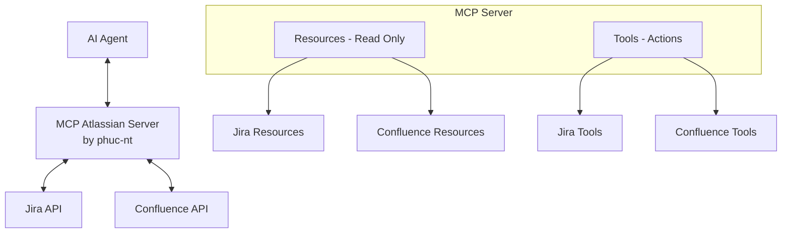

# Hướng Dẫn Phát Triển AI Agent - Phần 3: Đi Sâu Vào Sub-agent và MCP

> **Tài liệu hướng dẫn dành cho kỹ sư phát triển AI Agent tại công ty.**
>
> Bộ tài liệu này gồm 3 phần:
> - [Phần 1: Kiến Trúc Tổng Quan](./ai_agent_development_guide_part1.md)
> - [Phần 2: Chi Tiết Bên Trong Central Agent](./ai_agent_development_guide_part2.md)
> - [Phần 3: Đi Sâu Vào Sub-agent và MCP](./ai_agent_development_guide_part3.md) (tài liệu hiện tại)

## Giới thiệu

Trong [Phần 1](./ai_agent_development_guide_part1.md) và [Phần 2](./ai_agent_development_guide_part2.md), chúng ta đã tìm hiểu về kiến trúc tổng thể của hệ thống Central-Sub Agent và chi tiết cách hoạt động của Central Agent. Phần 3 sẽ đi sâu vào "lớp dưới cùng" của hệ thống - nơi các Sub-agent tương tác trực tiếp với thế giới bên ngoài.

Phần này sẽ tập trung giải thích cách triển khai Sub-agent hiệu quả, đặc biệt là cách sử dụng Model Context Protocol (MCP) để tạo ra Sub-agent linh hoạt, mạnh mẽ và bảo mật.

## 1. Sub-agent trong kiến trúc Agent

### 1.1 Vai trò của Sub-agent

Sub-agent là các thành phần chuyên biệt trong hệ thống AI Agent, mỗi agent đảm nhận một nhiệm vụ cụ thể và tương tác với một hệ thống bên ngoài nhất định. Có thể hình dung Sub-agent như các "chuyên gia" được Central Agent điều phối để hoàn thành các nhiệm vụ phức tạp.



### 1.2 Đặc điểm của Sub-agent

Mỗi Sub-agent lý tưởng cần đáp ứng các đặc điểm sau:

1. **Tính chuyên biệt**: Tập trung vào một miền cụ thể (Jira, Slack, Calendar...)
2. **Giao diện nhất quán**: Cung cấp giao diện chuẩn hóa để Central Agent dễ dàng điều phối
3. **Khả năng xử lý lỗi**: Đảm bảo xử lý các trường hợp ngoại lệ từ API bên ngoài
4. **Khả năng diễn giải**: Chuyển đổi giữa ngôn ngữ tự nhiên và yêu cầu API cụ thể
5. **Kiểm soát quyền truy cập**: Đảm bảo an toàn khi tương tác với hệ thống bên ngoài

### 1.3 Các phương pháp triển khai Sub-agent

Có nhiều cách để triển khai Sub-agent, mỗi cách có ưu và nhược điểm riêng:

| Phương pháp | Mô tả | Ưu điểm | Nhược điểm |
|-------------|-------|---------|------------|
| **Trực tiếp** | Sub-agent gọi trực tiếp API bên ngoài | Đơn giản, kiểm soát cao | Phụ thuộc vào cấu trúc API, khó bảo trì |
| **SDK/Thư viện** | Sử dụng thư viện có sẵn để gọi API | Tận dụng mã đã được kiểm thử, tiết kiệm thời gian | Phụ thuộc vào cập nhật của thư viện bên thứ ba |
| **Function Calling** | Định nghĩa chức năng và để LLM quyết định cách gọi | Linh hoạt, dễ mở rộng | Có thể không chính xác, khó kiểm soát |
| **MCP (Model Context Protocol)** | Giao thức chuẩn để AI tương tác với hệ thống bên ngoài | Tiêu chuẩn hóa, bảo mật, linh hoạt | Đòi hỏi triển khai MCP server |

## 2. Model Context Protocol (MCP)

### 2.1 MCP là gì?

Model Context Protocol (MCP) là một giao thức mở cho phép mô hình AI tương tác với các nguồn dữ liệu và hệ thống bên ngoài theo cách tiêu chuẩn hóa. MCP giải quyết một thách thức quan trọng: làm thế nào để AI có thể truy cập và tương tác với dữ liệu và chức năng của thế giới thực một cách an toàn, hiệu quả.



MCP cung cấp một framework có cấu trúc để:
- Truy vấn dữ liệu từ nhiều nguồn khác nhau
- Thực hiện các hành động trên hệ thống bên ngoài
- Đảm bảo tính nhất quán trong tương tác giữa AI và các hệ thống

### 2.2 Các thành phần chính của MCP

Hệ sinh thái MCP bao gồm các thành phần chính:

1. **MCP Client**: Thư viện cho phép AI tương tác với MCP Server
2. **MCP Server**: Cầu nối kết nối yêu cầu từ AI với các hệ thống backend
3. **Transports**: Các kênh giao tiếp giữa client và server (STDIO, HTTP/SSE, WebSockets)

### 2.3 Khái niệm cốt lõi trong MCP

#### 2.3.1 Resources (Tài nguyên dữ liệu)

Resources là phương tiện chính để AI truy xuất dữ liệu trong MCP. Chúng là các thực thể dữ liệu có thể địa chỉ hóa thông qua URI.

```
jira://issues            - Danh sách tất cả issues
jira://issues/PROJ-123   - Chi tiết về issue cụ thể
```

**Đặc điểm của resources:**
- **Chỉ đọc**: Dùng để truy vấn/đọc dữ liệu, không thay đổi trạng thái
- **Có cấu trúc**: Dữ liệu trả về có cấu trúc nhất quán
- **Có thể lọc**: Thường hỗ trợ tham số truy vấn để lọc kết quả

#### 2.3.2 Tools (Công cụ hành động)

Tools là các chức năng cho phép AI thực hiện hành động thay đổi trạng thái hệ thống. Tools giống như các hàm có tham số và trả về kết quả.

```typescript
// Ví dụ định nghĩa tool trong MCP
{
  name: "createIssue",
  description: "Tạo một issue mới trong Jira",
  input: {
    projectKey: "string", // Mã dự án
    summary: "string",    // Tiêu đề issue
    description: "string" // Mô tả issue
  }
}
```

**Đặc điểm của tools:**
- **Thay đổi trạng thái**: Dùng để tạo, cập nhật hoặc xóa dữ liệu
- **Có tham số**: Yêu cầu đầu vào cụ thể và được xác thực
- **Trả về kết quả**: Thông báo kết quả của hành động đã thực hiện

### 2.4 So sánh MCP với Function Calling

| Khía cạnh | MCP | Function Calling |
|-----------|-----|------------------|
| **Chuẩn hóa** | Giao thức chuẩn, nhất quán giữa các ứng dụng | Tùy thuộc vào triển khai cụ thể |
| **Kiểu dữ liệu** | Resources và Tools | Functions với đầu vào/đầu ra |
| **Tương tác** | Tương tác hai chiều, hỗ trợ streaming | Thường là cuộc gọi một lần |
| **Phạm vi** | Được thiết kế như một giao thức mở, đa nền tảng | Thường gắn liền với một mô hình LLM cụ thể |
| **Bảo mật** | Hỗ trợ kiểm soát quyền truy cập và giới hạn | Phụ thuộc vào triển khai |

## 3. Triển khai Sub-agent sử dụng MCP

### 3.1 Kiến trúc và quy trình giao tiếp MCP Sub-agent

Sub-agent MCP được xây dựng với kiến trúc tiêu chuẩn cho phép đồng thời tách biệt logic xử lý và đơn giản hóa tương tác API. Dưới đây là hai biểu đồ minh họa cả cấu trúc tĩnh và luồng giao tiếp động trong quá trình xử lý yêu cầu.



Mỗi thành phần trong hệ thống đảm nhận một vai trò rõ ràng:

- **Agent Coordinator**: Điều phối yêu cầu đến đúng Sub-agent chuyên biệt
- **Prompt Processor**: Chuyển đổi ngôn ngữ tự nhiên thành ý định và thực thể
- **MCP Client**: Kết nối và gửi yêu cầu đến MCP Server theo chuẩn MCP
- **MCP Server**: Chuyển đổi yêu cầu MCP thành API call tương ứng

Luồng xử lý một yêu cầu được mô tả chi tiết trong sequence diagram sau:



Các đặc điểm nổi bật của kiến trúc MCP Sub-agent:

1. **Chuyển đổi ngôn ngữ**: Tự động phân tích yêu cầu tự nhiên thành lệnh MCP
2. **Tách biệt concerns**: Logic Sub-agent tách biệt khỏi chi tiết API
3. **Chuẩn hóa giao diện**: Thống nhất giao thức giao tiếp giữa các hệ thống
4. **Hỗ trợ đọc/ghi**: Đồng thời hỗ trợ truy vấn dữ liệu và thực hiện hành động
5. **Bảo mật**: Kiểm soát quyền truy cập chính xác đến từng resource/tool

### 3.2 Lợi ích của Sub-agent dựa trên MCP

1. **Tách biệt mối quan tâm**: MCP tách biệt logic của Sub-agent khỏi chi tiết kết nối API
2. **Giao diện nhất quán**: Các Sub-agent có giao diện thống nhất bất kể hệ thống bên ngoài
3. **Khả năng mở rộng**: Dễ dàng thêm resource/tool mới mà không ảnh hưởng đến Central Agent
4. **Bảo mật cao hơn**: Kiểm soát chính xác dữ liệu và hành động mà AI có thể thực hiện
5. **Tái sử dụng**: MCP Server có thể được sử dụng bởi nhiều ứng dụng AI khác nhau

## 4. MCP Atlassian Server

### 4.1 Giới thiệu

**[MCP Atlassian Server (by phuc-nt)](https://github.com/phuc-nt/mcp-atlassian-server)** là một triển khai đầy đủ của MCP server cho hệ thống Atlassian, được thiết kế để tương thích ngay lập tức với nhiều loại AI Agent hỗ trợ MCP client như Cline, GitHub Copilot và Claude.

Server này đóng vai trò trung gian kết nối giữa AI Agent và hệ thống Atlassian (Jira & Confluence), cho phép:
- Truy vấn dữ liệu thông qua resources có cấu trúc rõ ràng
- Thực hiện hành động qua tools được định nghĩa chuẩn xác
- Tương tác an toàn giữa AI và hệ thống Atlassian

Đặc điểm vượt trội:
- **Sẵn sàng sử dụng**: Không cần phát triển MCP server từ đầu
- **Tương thích rộng rãi**: Hoạt động với mọi AI Agent hỗ trợ giao thức MCP
- **Đã được kiểm chứng**: Được thử nghiệm trên nhiều hệ thống thực tế
- **Toàn diện**: Bao gồm hơn 38 resources và 24 tools cho Jira và Confluence
- **Bảo mật**: Hệ thống quản lý quyền truy cập và xác thực chặt chẽ

> **Lời khuyên cho người học**: Nếu bạn muốn hiểu sâu về MCP, hãy trải nghiệm ngay [MCP Atlassian Server (by phuc-nt)](https://github.com/phuc-nt/mcp-atlassian-server). Đây là cách học hiệu quả nhất để nắm vững cả lý thuyết và thực hành MCP.

#### Kiến trúc tích hợp:



Để bắt đầu sử dụng trong Auto Workflow Agent, bạn cần:
1. Cài đặt [MCP Atlassian Server (by phuc-nt)](https://github.com/phuc-nt/mcp-atlassian-server): `npm install @phuc-nt/mcp-atlassian-server`
2. Cài đặt MCP Client SDK: `npm install @modelcontextprotocol/sdk`
3. Cấu hình kết nối với Atlassian qua biến môi trường hoặc tệp cấu hình
4. Tạo MCP Agent kết nối với MCP Client và Central Agent


> **Nguyên tắc bảo mật**: Agent chỉ có thể thực hiện các hành động trong phạm vi quyền được cấp thông qua token. Cân nhắc kỹ khi cấp quyền cho AI Agent.

### 4.2 Hướng dẫn tích hợp cụ thể

> **Lưu ý**: Phần hướng dẫn tích hợp chi tiết sẽ được bổ sung sau khi ra mắt AWA (Auto Workflow Agent), một nền tảng AI Agent được phát triển nội bộ để tận dụng toàn bộ khả năng của MCP trong doanh nghiệp.

**COMING SOON !!!**

Trong thời gian chờ đợi, các nhà phát triển có thể:

1. **Khám phá [MCP Atlassian Server (by phuc-nt)](https://github.com/phuc-nt/mcp-atlassian-server)** - Tìm hiểu về các resources và tools có sẵn
2. **Tham khảo tài liệu MCP** - Để hiểu rõ hơn về giao thức và cách triển khai
3. **Thử nghiệm với các AI Agent hiện có** - Sử dụng với Cline hoặc Github Copilot


### 4.3 Lợi ích và ứng dụng

[MCP Atlassian Server (by phuc-nt)](https://github.com/phuc-nt/mcp-atlassian-server) mang lại nhiều giá trị quan trọng cho các AI Agent:

| Khía cạnh | Lợi ích |
|-----------|---------|
| **Kỹ thuật** | • Tuân thủ tiêu chuẩn MCP<br>• Triển khai nhanh chóng<br>• Bảo trì dễ dàng<br>• Bảo mật tốt hơn |
| **Kinh doanh** | • Tăng năng suất quản lý dự án<br>• Giảm sai sót trong tương tác<br>• Tiết kiệm thời gian phát triển |
| **Trải nghiệm** | • Giao diện ngôn ngữ tự nhiên<br>• Tương tác liền mạch với Atlassian |

#### Trường hợp sử dụng tiêu biểu

- **Quản lý Agile**: Tự động hóa tạo issues, cập nhật sprint, báo cáo tiến độ
- **Quản lý tri thức**: Tạo, truy vấn và cập nhật tài liệu Confluence
- **Trợ lý phát triển**: Hỗ trợ đội ngũ kỹ thuật với các tác vụ Jira hàng ngày
- **Phân tích dữ liệu**: Tổng hợp thông tin từ nhiều nguồn Atlassian

## 5. Tổng kết và triển vọng

MCP mở ra một kỷ nguyên mới trong việc xây dựng AI Agent linh hoạt, cho phép tương tác an toàn và hiệu quả với nhiều hệ thống doanh nghiệp.

### 5.1 Xu hướng phát triển 

| Hướng | Mô tả ngắn gọn |
|-------|----------------|
| **Mở rộng hệ sinh thái** | Phát triển MCP Server cho các servivce khác như GitHub, Slack, Mail, Calendar... |
| **AI Agent tiên tiến** | Tích hợp Agentic-RAG và cơ chế tự học để cải thiện hiệu quả |
| **Sub-agent đa dạng** | Sub-agent chuyên biệt, khả năng kết hợp và hoạt động trên nhiều nền tảng |

### 5.2 Kết luận

[MCP Atlassian Server (by phuc-nt)](https://github.com/phuc-nt/mcp-atlassian-server) là minh chứng cho tiềm năng của MCP, tạo nền tảng cho một hệ sinh thái AI Agent toàn diện. Sự chuẩn hóa này giúp các AI Agent không chỉ tương tác hiệu quả với hệ thống bên ngoài mà còn có thể phối hợp cùng nhau, mở ra khả năng ứng dụng mạnh mẽ trong môi trường doanh nghiệp.

---

> "Sức mạnh của MCP không chỉ nằm ở khả năng kết nối AI với hệ thống bên ngoài, mà còn ở việc tạo ra một tiêu chuẩn chung để các AI Agent khác nhau có thể hoạt động cùng nhau như một hệ sinh thái toàn diện, mở rộng khả năng của các hệ thống AI hiện đại."

---

*Cập nhật lần cuối: Tháng 5, 2025*
