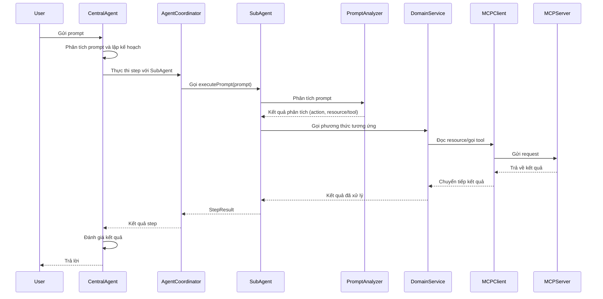
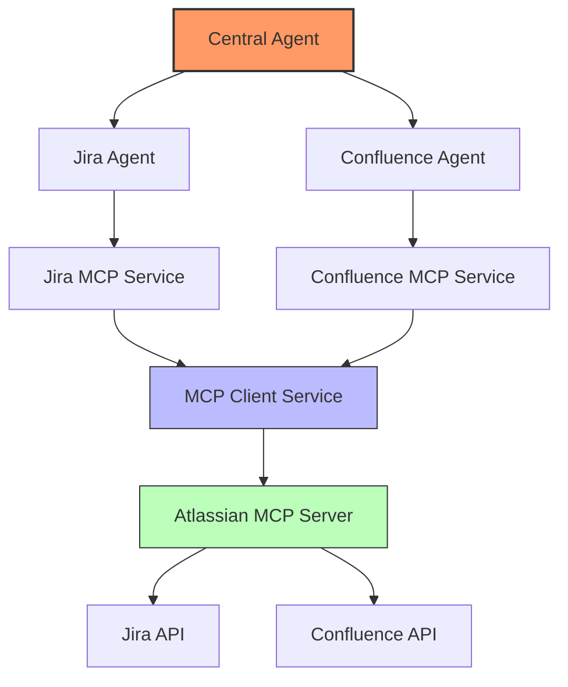
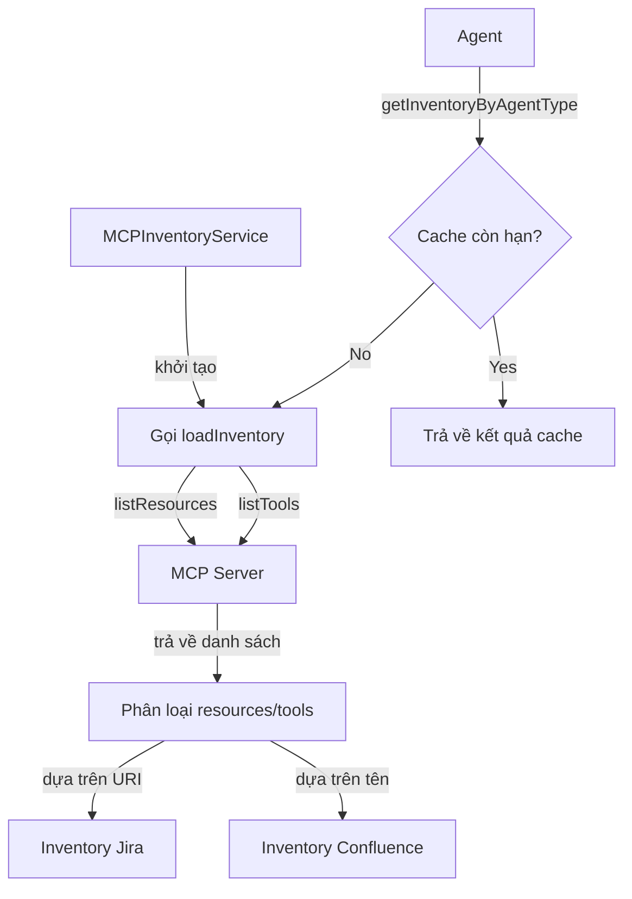
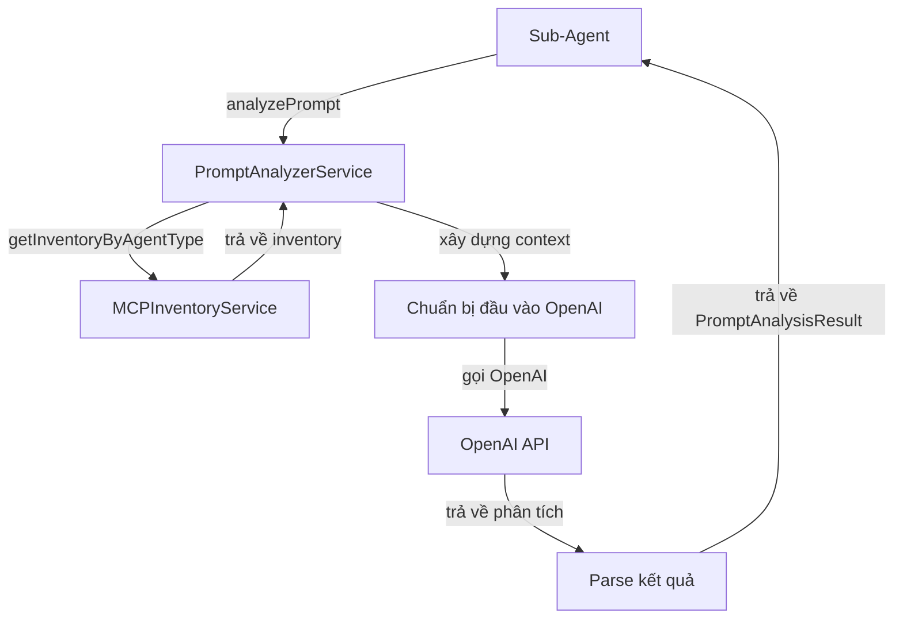
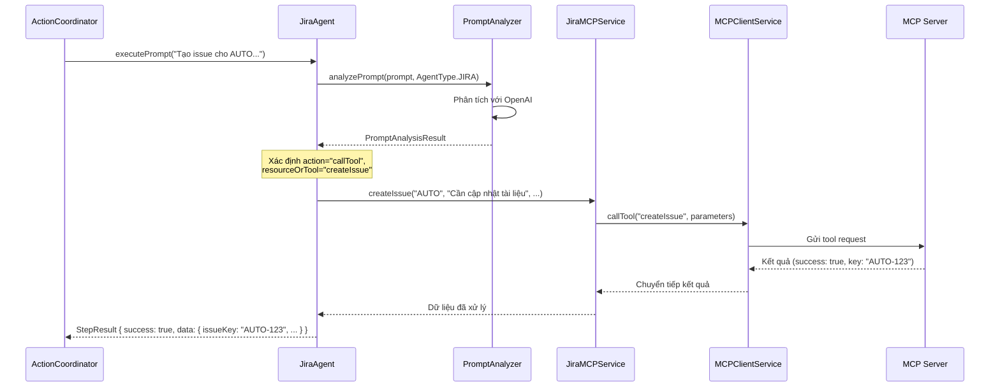
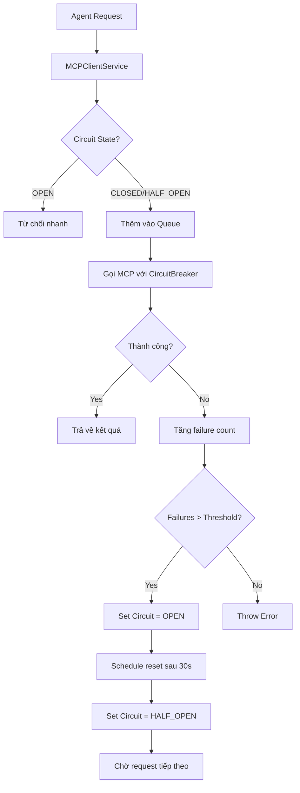
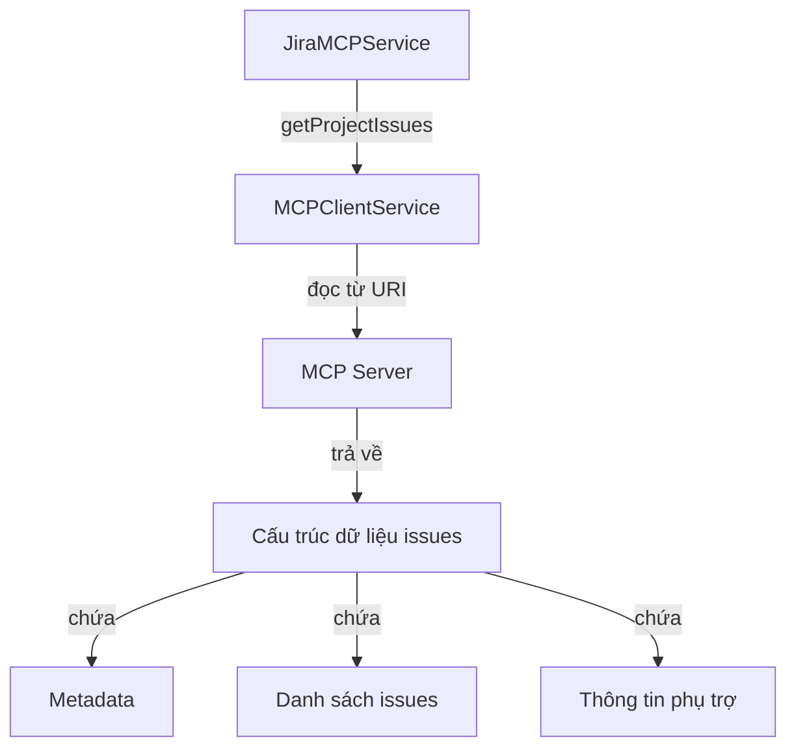
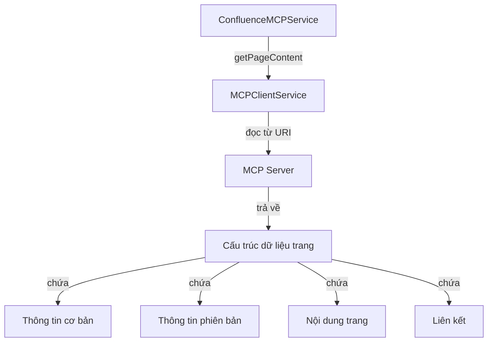
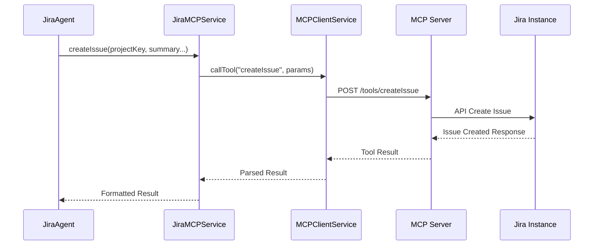
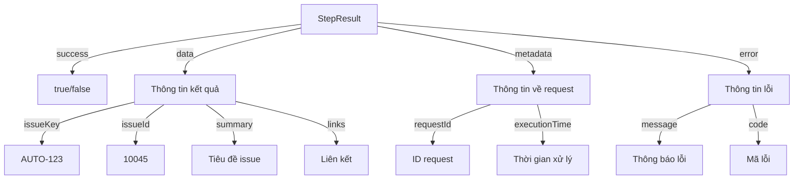

# Hướng dẫn Chi tiết: Triển khai Sub-Agent với MCP Client

## 1. Giới thiệu

Tài liệu này mô tả chi tiết cách thiết kế và triển khai một Sub-Agent sử dụng Model Context Protocol (MCP) Client để tương tác với các hệ thống bên ngoài (như Jira, Confluence, Slack, v.v.). Nó là một phần mở rộng chi tiết của [Hướng dẫn Phát triển AI Agent (Phần 3)](./ai_agent_development_guide_part3.md), tập trung vào việc cài đặt và tích hợp Sub-Agent với MCP.

### 1.1 Các thành phần chính

Một Sub-Agent sử dụng MCP thường bao gồm các thành phần sau:

- **Agent Class**: Lớp chính của Sub-Agent, triển khai giao diện `IAgent` và chịu trách nhiệm phân tích prompt, gọi service tương ứng.
- **MCP Client Service**: Service làm việc trực tiếp với MCP SDK để giao tiếp với MCP Server.
- **Domain-specific Service**: Service triển khai logic nghiệp vụ cho một domain cụ thể (ví dụ: JiraMCPService cho Jira).
- **Prompt Analyzer Service**: Service phân tích prompt của người dùng và xác định cần gọi resource/tool nào của MCP.
- **MCP Inventory Service**: Service quản lý và lưu trữ danh sách resource/tool có sẵn từ MCP Server.

### 1.2 Luồng hoạt động tổng quát

1. **Central Agent** nhận prompt từ người dùng, phân tích và lập kế hoạch thực thi.
2. Khi đến lượt một bước (step) trong kế hoạch, **Agent Coordinator** gọi Sub-Agent phù hợp.
3. **Sub-Agent** nhận prompt, phân tích bằng Prompt Analyzer để xác định cần gọi resource/tool nào.
4. **Sub-Agent** gọi đến service tương ứng (ví dụ: JiraMCPService) để thực hiện thao tác.
5. **Domain-specific Service** giao tiếp với MCP Client Service để gọi đến MCP Server.
6. Kết quả được trả về theo chuỗi ngược lại, và Central Agent sẽ đánh giá kết quả của Sub-Agent.

Dưới đây là sequence diagram mô tả chi tiết luồng hoạt động:



## 2. Jira và Confluence Agent với MCP Server Chung

### 2.1 Kiến trúc MCP Server Chung

Jira và Confluence agent đều sử dụng Atlassian MCP Server, đây là một server cung cấp khả năng truy cập đến cả Jira và Confluence API thông qua một kết nối duy nhất. Kiến trúc này mang lại nhiều lợi ích:



### 2.2 MCPClientService (Thành phần Dùng Chung)

MCPClientService là thành phần dùng chung, quản lý một kết nối duy nhất đến Atlassian MCP Server. Điều này rất quan trọng để đảm bảo hiệu quả vì việc tạo nhiều kết nối sẽ lãng phí tài nguyên.

**Tính năng chính:**
- Thiết lập và duy trì một kết nối duy nhất đến MCP Server
- Cung cấp các phương thức cho cả Jira và Confluence service sử dụng
- Xử lý xác thực và quản lý phiên
- Thực hiện connection pooling và xử lý lỗi
- Cung cấp phương thức đọc resource và gọi tool

**Cấu trúc và Hoạt động:**

- **Kết nối Đơn lẻ**: Duy trì một kết nối duy nhất đến MCP Server, được chia sẻ cho tất cả các service
- **Lazy Initialization**: Chỉ thiết lập kết nối khi cần thiết, giúp tiết kiệm tài nguyên
- **Connection Promise**: Sử dụng Promise để đảm bảo nhiều request đồng thời không tạo nhiều kết nối
- **Retry Mechanism**: Tự động thử lại khi kết nối bị mất
- **Circuit Breaker**: Ngăn chặn gọi liên tục đến MCP Server khi phát hiện lỗi liên tiếp

**Các phương thức chính:**
- `readResource(uri)`: Đọc dữ liệu từ một resource theo URI
- `callTool(name, parameters)`: Gọi một tool với các tham số
- `ensureConnection()`: Đảm bảo kết nối đã được thiết lập
- `listResources()`: Lấy danh sách tất cả resources có sẵn
- `listTools()`: Lấy danh sách tất cả tools có sẵn

### 2.3 Domain-Specific Services

#### 2.3.1 JiraMCPService

JiraMCPService chịu trách nhiệm xử lý các thao tác liên quan đến Jira. Nó sử dụng MCPClientService dùng chung để giao tiếp với MCP Server.

**Tính năng chính:**
- Xây dựng các URI resource của Jira
- Ánh xạ các thao tác của domain sang MCP tools và resources
- Xử lý các trường hợp lỗi đặc thù của Jira
- Cung cấp API sạch và có kiểu dữ liệu cho Jira Agent

**Cấu trúc và Hoạt động:**

- **Domain-specific URIs**: Xây dựng và quản lý các URI resource theo định dạng `jira://[resource-path]`
- **Error Handling**: Xử lý các lỗi đặc thù của Jira (ví dụ: permission errors, invalid JQL)
- **Result Parsing**: Chuyển đổi kết quả từ MCP Server thành các đối tượng có ý nghĩa
- **Type Safety**: Cung cấp các interface và type safety cho dữ liệu Jira

**Các phương thức chính:**
- `getProjects()`: Lấy danh sách tất cả các dự án
- `getProject(projectKey)`: Lấy thông tin chi tiết về một dự án
- `getIssues(projectKey, filters)`: Lấy danh sách issues với các bộ lọc
- `getIssue(issueKey)`: Lấy thông tin chi tiết về một issue
- `createIssue(projectKey, summary, ...)`: Tạo một issue mới
- `updateIssue(issueKey, fields)`: Cập nhật một issue
- `getUsers(projectKey)`: Lấy danh sách người dùng trong dự án

#### 2.3.2 ConfluenceMCPService

ConfluenceMCPService tương tự như JiraMCPService nhưng tập trung vào các thao tác của Confluence. Nó cũng sử dụng MCPClientService dùng chung.

**Tính năng chính:**
- Xây dựng các URI resource của Confluence
- Ánh xạ các thao tác của domain sang MCP tools và resources
- Xử lý các trường hợp lỗi đặc thù của Confluence
- Cung cấp API sạch và có kiểu dữ liệu cho Confluence Agent

**Cấu trúc và Hoạt động:**

- **Domain-specific URIs**: Xây dựng và quản lý các URI resource theo định dạng `confluence://[resource-path]`
- **Content Handling**: Xử lý đặc biệt cho nội dung Confluence (storage format, macro)
- **Error Handling**: Xử lý các lỗi đặc thù của Confluence (space permissions, content restrictions)
- **Hierarchical Navigation**: Hỗ trợ điều hướng qua cấu trúc phân cấp (space > page > child pages)

**Các phương thức chính:**
- `getSpaces()`: Lấy danh sách tất cả các spaces
- `getSpace(spaceKey)`: Lấy thông tin chi tiết về một space
- `getPages(spaceKey)`: Lấy danh sách trang trong một space
- `getPage(pageId)`: Lấy thông tin chi tiết về một trang
- `createPage(spaceKey, title, content)`: Tạo một trang mới
- `updatePage(pageId, content, title)`: Cập nhật một trang
- `getChildren(pageId)`: Lấy danh sách các trang con

### 2.4 Agent Implementations

#### 2.4.1 MCPJiraAgent

MCPJiraAgent triển khai giao diện IAgent và sử dụng JiraMCPService để tương tác với Jira.

**Tính năng chính:**
- Triển khai phương thức executePrompt theo yêu cầu của IAgent
- Sử dụng PromptAnalyzer để xác định ý định của người dùng
- Ánh xạ ý định người dùng sang các phương thức của JiraMCPService
- Xử lý các trường hợp lỗi và fallback
- Trả về kết quả dạng StepResult chuẩn hóa

**Cấu trúc và Hoạt động:**

- **IAgent Implementation**: Triển khai interface IAgent, định nghĩa phương thức executePrompt
- **Prompt Analysis**: Phân tích prompt để xác định action cần thực hiện (đọc resource hoặc gọi tool)
- **Confidence Threshold**: Sử dụng ngưỡng confidence để xác định khi nào sử dụng phương pháp phân tích thay thế
- **Fallback Mechanism**: Cung cấp phương pháp phân tích dự phòng dựa trên regex khi LLM không đủ confident
- **Action Mapping**: Ánh xạ kết quả phân tích thành các lời gọi phương thức của JiraMCPService
- **Error Handling**: Xử lý lỗi ngay trong agent, đóng gói thành StepResult

**Luồng xử lý chính:**
1. Nhận prompt từ AgentCoordinator
2. Phân tích prompt với PromptAnalyzer
3. Kiểm tra confidence của kết quả phân tích
4. Dựa vào resourceOrTool, xác định phương thức cần gọi của JiraMCPService
5. Gọi phương thức và nhận kết quả
6. Đóng gói kết quả thành StepResult và trả về

#### 2.4.2 MCPConfluenceAgent

MCPConfluenceAgent tương tự như MCPJiraAgent nhưng tập trung vào các thao tác của Confluence.

**Tính năng chính:**
- Triển khai phương thức executePrompt theo yêu cầu của IAgent
- Sử dụng PromptAnalyzer để xác định ý định của người dùng
- Ánh xạ ý định người dùng sang các phương thức của ConfluenceMCPService
- Xử lý các trường hợp lỗi và fallback
- Trả về kết quả dạng StepResult chuẩn hóa

**Cấu trúc và Hoạt động:**

- **IAgent Implementation**: Triển khai interface IAgent, tương tự như MCPJiraAgent
- **Domain-specific Analysis**: Phân tích prompt với context đặc thù của Confluence
- **Metadata Enrichment**: Bổ sung metadata vào kết quả để giúp Central Agent hiểu rõ hơn
- **Content Processing**: Xử lý đặc biệt cho nội dung định dạng phong phú của Confluence
- **Hierarchical Navigation**: Hỗ trợ điều hướng qua cấu trúc phân cấp (space > page > child pages)
- **Link Resolution**: Giải quyết các liên kết và tham chiếu giữa các trang

**Luồng xử lý chính:**
1. Nhận prompt từ AgentCoordinator
2. Phân tích prompt với PromptAnalyzer, xác định context Confluence
3. Kiểm tra confidence của kết quả phân tích
4. Dựa vào resourceOrTool, xác định phương thức cần gọi của ConfluenceMCPService
5. Xử lý các tham số đặc biệt (như content với macro, table, định dạng)
6. Gọi phương thức và nhận kết quả
7. Đóng gói kết quả với các liên kết liên quan và trả về

### 2.5 Khai Phá (Discovery) Resource và Tool Dùng Chung

MCPInventoryService là một thành phần quan trọng cho cả hai agent, nó khám phá các resource và tool từ Atlassian MCP Server và phân loại chúng theo từng loại agent.

**Tính năng chính:**
- Khám phá các resource và tool có sẵn từ MCP Server
- Phân loại resource và tool theo loại agent (Jira, Confluence)
- Cung cấp metadata của resource và tool cho PromptAnalyzer
- Cache inventory để tránh gọi server thường xuyên

**Cấu trúc và Hoạt động:**

- **Resource Discovery**: Tự động khám phá các resources và tools có sẵn từ MCP Server
- **Domain Classification**: Phân loại resources và tools theo domain (Jira, Confluence) dựa trên URI pattern và naming
- **Caching Strategy**: Cache kết quả discovery trong một khoảng thời gian nhất định để giảm tải cho MCP Server
- **Lazy Loading**: Tải inventory khi khởi động và làm mới theo nhu cầu
- **Error Resilience**: Xử lý lỗi khi không thể kết nối đến MCP Server

**Luồng hoạt động chính:**
1. Khi khởi động, service sẽ tải inventory ban đầu từ MCP Server
2. Resources được phân loại dựa trên URI pattern (jira://, confluence://)
3. Tools được phân loại dựa trên tên (contains 'issue', 'page', etc.)
4. Kết quả được lưu cache với TTL (thời gian sống)
5. Khi một agent yêu cầu inventory, service kiểm tra xem cache có còn hợp lệ không
6. Nếu cache đã hết hạn, service sẽ làm mới inventory từ MCP Server



### 2.6 Prompt Analyzer Service

PromptAnalyzerService là thành phần quan trọng giúp phân tích prompt từ người dùng và xác định họ muốn sử dụng resource/tool nào từ MCP Server.

**Tính năng chính:**
- Phân tích prompt của người dùng bằng OpenAI
- Xác định action cần thực hiện (đọc resource hoặc gọi tool)
- Xác định resource/tool cụ thể cần sử dụng
- Trích xuất parameters từ prompt
- Đánh giá mức độ tin cậy của phân tích

**Cấu trúc và Hoạt động:**

- **LLM Integration**: Sử dụng OpenAI để phân tích ngôn ngữ tự nhiên từ prompt
- **Function Calling**: Sử dụng OpenAI function calling để trích xuất tham số một cách có cấu trúc
- **Domain-specific Context**: Cung cấp cho LLM context đặc thù của từng domain (Jira, Confluence)
- **Confidence Scoring**: Đánh giá mức độ tin cậy của kết quả phân tích
- **Fallback Strategy**: Cung cấp chiến lược dự phòng khi LLM không thể phân tích chắc chắn

**Luồng xử lý chính:**
1. Nhận prompt và loại agent (JIRA, CONFLUENCE)
2. Lấy inventory cho loại agent đó từ MCPInventoryService
3. Xây dựng system prompt và function definitions dựa trên inventory
4. Gọi OpenAI với đầu vào đã chuẩn bị
5. Phân tích kết quả từ OpenAI, trích xuất action, resource/tool và parameters
6. Đánh giá mức độ tin cậy của phân tích
7. Trả về kết quả phân tích cho agent



### 2.6 Chia Sẻ MCP Server Hiệu Quả

Để chia sẻ Atlassian MCP Server giữa Jira và Confluence agent một cách hiệu quả, hãy xem xét các practices sau:

1. **Kết nối Đơn lẻ**: Duy trì một kết nối duy nhất đến MCP Server thông qua MCPClientService dùng chung.

2. **Connection Pooling**: Nếu cần nhiều kết nối cho throughput cao, triển khai connection pooling với số lượng pool cố định.

3. **Cache Resource**: Cache các resource thường sử dụng (như danh sách dự án) để giảm tải cho MCP Server.

4. **Batching Requests**: Khi có thể, gom nhóm nhiều request nhỏ thành một request lớn hơn.

5. **Tách biệt Domain**: Giữ logic đặc thù cho từng domain trong các service riêng biệt (JiraMCPService, ConfluenceMCPService) trong khi chia sẻ kết nối bên dưới.

6. **Cô lập Lỗi**: Đảm bảo lỗi trong một domain không ảnh hưởng đến hoạt động trong domain khác.

7. **Tái kết nối Graceful**: Triển khai logic tái kết nối graceful có thể sử dụng bởi cả hai domain nếu kết nối bị mất.

8. **Rate Limiting**: Triển khai rate limiting để đảm bảo một domain không tiêu thụ quá nhiều tài nguyên, ảnh hưởng đến domain khác.

9. **Xử lý Bất đồng bộ**: Sử dụng xử lý bất đồng bộ để tránh chặn luồng xử lý chính.

10. **Monitoring Chung**: Thiết lập hệ thống monitoring cho kết nối MCP Server dùng chung để theo dõi hiệu suất và phát hiện vấn đề.

## 3. Luồng Xử lý Chi tiết của Shared MCP Server

### 3.1 Khởi tạo và Cài đặt Hệ thống

Quá trình khởi động trong môi trường chia sẻ MCP Server diễn ra như sau:

1. **Khởi tạo MCP Client Dùng Chung**: `MCPClientService` được khởi tạo một lần duy nhất, thiết lập kết nối bền vững đến Atlassian MCP Server, được chia sẻ bởi cả Jira và Confluence.

2. **Inventory Discovery**: `MCPInventoryService` lấy danh sách toàn bộ resources và tools từ MCP Server, sau đó phân loại chúng theo domain (Jira hoặc Confluence) dựa trên URI pattern và tên.

3. **Khởi tạo Domain Services**: `JiraMCPService` và `ConfluenceMCPService` được khởi tạo song song, cả hai đều tiêm vào (inject) cùng một instance của `MCPClientService`.

4. **Thiết lập Analyzer**: `PromptAnalyzerService` được khởi tạo với các inventory từ cả hai domain, sẵn sàng phân tích prompt cho bất kỳ loại agent nào.

5. **Khởi tạo Agents**: `MCPJiraAgent` và `MCPConfluenceAgent` được khởi tạo, mỗi agent sử dụng service tương ứng của mình và PromptAnalyzer dùng chung.

### 3.2 Luồng Xử lý Prompt Thực tế

Một ví dụ thực tế về prompt "Tạo một issue cho dự án AUTO với tiêu đề 'Cần cập nhật tài liệu'":



**Luồng xử lý chi tiết:**

1. **Nhận Prompt**: `MCPJiraAgent` nhận prompt từ ActionCoordinator

2. **Phân tích Prompt**: Prompt được gửi đến PromptAnalyzerService để phân tích
   - Action: callTool
   - ResourceOrTool: createIssue
   - Parameters: projectKey="AUTO", summary="Cần cập nhật tài liệu", issueType="Task"
   - Confidence: 0.92

3. **Gọi Domain Service**: JiraMCPService được gọi với parameters đã được trích xuất

4. **Sử dụng MCP Client Dùng Chung**: JiraMCPService sử dụng MCPClientService để gọi tool trên MCP Server

5. **Kết quả Trả về**: MCP Server trả về kết quả, được xử lý qua các lớp và cuối cùng được đóng gói thành StepResult trả về cho ActionCoordinator

### 3.3 Cơ chế Xử lý Lỗi và Retry Đồng bộ

MCP Server dùng chung yêu cầu cơ chế xử lý lỗi phối hợp để đảm bảo một domain không làm ảnh hưởng đến domain khác:



1. **Lỗi Kết nối Thống nhất**: Khi kết nối MCP Server bị gián đoạn, `MCPClientService` sẽ thực hiện tái kết nối tập trung một lần duy nhất, tránh nhiều request tái kết nối đồng thời từ các agent khác nhau.

2. **Circuit Breaker Chia sẻ**: Cơ chế Circuit Breaker duy nhất được triển khai trong `MCPClientService`, theo dõi lỗi từ MCP Server để bảo vệ tất cả các agent, với các trạng thái:
   - **CLOSED**: Hoạt động bình thường, tất cả request được chuyển tiếp đến MCP Server
   - **OPEN**: Phát hiện nhiều lỗi, tất cả request được từ chối nhanh
   - **HALF_OPEN**: Trạng thái thử lại, cho phép một số request để kiểm tra liệu MCP Server đã hoạt động trở lại chưa

3. **Resource Contention**: Khi nhiều agent cạnh tranh tài nguyên MCP Server, cơ chế queue đảm bảo công bằng:
   - Giới hạn số lượng request đồng thời
   - Phân phối công bằng giữa các domain
   - Ưu tiên request quan trọng
   - Timeout cho request trong hàng đợi quá lâu

## 4. Mô hình Dữ liệu Trong Shared MCP Environment

### 4.1 Ví dụ Mô hình Dữ liệu MCP Resource Jira

Khi yêu cầu danh sách issues của dự án:

**Quy trình truy cập dữ liệu:**
- JiraMCPService gọi phương thức getProjectIssues(projectKey)
- Phương thức này đọc dữ liệu từ URI "jira://issues?project=projectKey"
- MCP Server xử lý và trả về danh sách issues

**Cấu trúc dữ liệu trả về:**
- Metadata: Chứa thông tin tổng quan như tổng số issues, giới hạn mỗi trang, liên kết
- Danh sách issues: Mỗi issue chứa ID, key, tóm tắt, trạng thái và các thông tin khác
- Thông tin phụ trợ: Liên kết để xem chi tiết, thời gian xử lý, v.v.



### 4.2 Ví dụ Mô hình Dữ liệu MCP Resource Confluence

Khi yêu cầu thông tin về một trang Confluence:

**Quy trình truy cập dữ liệu Confluence:**
- ConfluenceMCPService gọi phương thức getPageContent(pageId)
- Phương thức này đọc dữ liệu từ URI "confluence://pages/pageId"
- MCP Server xử lý và trả về nội dung trang

**Cấu trúc dữ liệu trang Confluence:**
- Thông tin cơ bản: ID, tiêu đề, không gian (space key)
- Thông tin phiên bản: Số phiên bản, người chỉnh sửa cuối, thời gian
- Nội dung trang: Định dạng lưu trữ (storage format) hoặc định dạng hiển thị
- Liên kết: Đường dẫn truy cập trang, tài liệu đính kèm, trang liên quan



### 4.3 Ví dụ Khi Tool Được Gọi Thành Công

Khi tạo một Issue mới trong Jira:

**Quy trình gọi tool:**
1. JiraMCPService gọi phương thức createIssue với các tham số cần thiết
2. Phương thức này chuyển tiếp đến MCPClientService để gọi tool "createIssue" 
3. MCPClientService gửi yêu cầu đến MCP Server với tham số được định dạng phù hợp

**Cấu trúc dữ liệu trả về:**
- Thông báo thành công (success: true)
- ID và key của issue mới tạo
- Thông báo xác nhận tạo thành công
- Các liên kết đến issue (self link và UI link)



### 4.4 Mô hình Step Result Chuẩn Cho Cả Hai Domain

Để đảm bảo tính nhất quán khi trả về kết quả từ các agent khác nhau, một format chuẩn được sử dụng:

```
Cấu trúc StepResult:
{
  success: boolean,          // Thành công hay thất bại
  data?: {                   // Dữ liệu trả về nếu thành công
    [key: string]: any,      // Dữ liệu đặc thù theo domain
    links?: {                // Links để hiển thị UI nếu có
      ui?: string,
      api?: string,
    }
  },
  error?: {                  // Thông tin lỗi nếu thất bại
    message: string,         // Thông báo lỗi người dùng có thể hiểu
    code?: string,           // Mã lỗi để chương trình xử lý
    details?: any,           // Chi tiết lỗi bổ sung
  },
  metadata?: {               // Metadata bổ sung
    requestId?: string,      // ID request để tracking
    serverInfo?: string,     // Thông tin server xử lý
    executionTime?: number,  // Thời gian xử lý (ms)
  }
}
```

Ví dụ kết quả tạo Issue từ JiraAgent:

**Ví dụ kết quả đã được định dạng:**
- **success**: true (thành công)
- **data**: Chứa thông tin về issue đã tạo
  - **issueKey**: "AUTO-123" (định danh issue)
  - **issueId**: "10045" (ID nội bộ của issue)
  - **summary**: "Cần cập nhật tài liệu" (tiêu đề issue)
  - **links**: Chứa các liên kết đến issue trên giao diện Jira
- **metadata**: Chứa thông tin về request
  - **requestId**: Mã định danh của request
  - **executionTime**: Thời gian xử lý tính bằng mili giây



## 5. Best Practices Khi Sử Dụng Shared MCP Server

### 5.1 Quản lý Tài nguyên Hiệu quả

1. **Pooling Connections**: Duy trì một pool kết nối tối ưu cho MCP Server, tránh tạo quá nhiều kết nối. Cấu hình cơ bản nên bao gồm số kết nối tối đa (thường 5-10 kết nối), số kết nối tối thiểu (2-3 kết nối) và thời gian chờ khi không hoạt động (khoảng 1 phút).

2. **Caching Thông minh**: Cache kết quả của các resource không thay đổi thường xuyên với thời gian sống (TTL) phù hợp. Dữ liệu như danh sách dự án, spaces có thể được cache lâu hơn (30 phút), trong khi dữ liệu như issues hoặc pages có thể được cache ngắn hơn (5-10 phút). Sử dụng Map hoặc LRU Cache để lưu trữ dữ liệu với key là URI và value là dữ liệu kèm timestamp.

3. **Rate Limiting Công bằng**: Đảm bảo công bằng giữa các domain khi truy cập MCP Server bằng cách thiết lập giới hạn tốc độ riêng cho mỗi domain. Ví dụ, mỗi domain có thể được phép gửi tối đa 100 request mỗi phút. Việc này đảm bảo một domain không chiếm toàn bộ tài nguyên và ảnh hưởng đến domain khác.

### 5.2 Xử lý Prompt Hiệu quả Với Danh Mục Dùng Chung

1. **Cải thiện System Prompt**: Khi phát triển các agent dùng chung MCP Server, nên cung cấp thông tin chi tiết về sự chia sẻ resources và tools trong system prompt để LLM hiểu việc phân loại đúng. Trong system prompt, mô tả rõ các loại resource và tool theo từng domain, giúp LLM phân biệt được khi nào nên sử dụng Jira resource và khi nào nên sử dụng Confluence resource.

2. **Domain-specific Matching**: Kỹ thuật semantic matching được tối ưu cho từng domain để xác định chính xác resource/tool. Khi phân tích prompt, lấy inventory đặc thù cho từng loại agent, xây dựng system prompt dựa trên inventory đó, và gọi LLM (như OpenAI) với context đặc thù của domain. Cung cấp function definitions dựa trên resources và tools của domain đó.

3. **Resource URI Templates**: Xây dựng URI templates cho cả hai domain để đảm bảo tính nhất quán trong việc truy cập MCP resources. Với Jira, các template có thể bao gồm URI cho projects, issues và users. Với Confluence, các template có thể bao gồm URI cho spaces, pages và attachments. Việc chuẩn hóa này giúp đảm bảo tất cả các phần của ứng dụng đều truy cập resources một cách nhất quán.

### 5.3 Monitoring và Logging Đa Domain

Trong môi trường chia sẻ MCP Server, cần có chiến lược monitoring và logging phù hợp:

1. **Structured Logging với Context**: Sử dụng structured logging với context domain cụ thể để phân biệt giữa các domain. Mỗi log entry nên chứa thông tin về domain ('jira' hoặc 'confluence'), tên service/class gọi, URI được truy cập, các tham số (được lọc thông tin nhạy cảm), và requestId để theo dõi toàn bộ chuỗi request.

2. **Shared Health Metrics**: Sử dụng metrics chung cho hệ thống kết nối MCP, nhưng phân tách theo domain. Các metrics quan trọng cần theo dõi bao gồm: tổng số request, thời gian phản hồi trung bình, tỷ lệ lỗi, và thời gian xử lý. Tất cả đều nên được gắn thẻ (tagged) theo domain và loại resource để dễ dàng phân tích riêng cho từng domain.

3. **Domain-specific Alerting**: Thiết lập ngưỡng cảnh báo cho từng domain để phát hiện vấn đề domain-specific. Ví dụ, đặt ngưỡng tỷ lệ lỗi cho Jira là 5% và cho Confluence là 8%. Tương tự, đặt ngưỡng thời gian phản hồi p95 cho Jira là 1 giây và cho Confluence là 1.5 giây (vì API Confluence thường chậm hơn một chút so với Jira).

### 5.4 Testing Hiệu quả

Để đảm bảo các agent dùng chung MCP Server hoạt động đúng, cần chiến lược testing toàn diện:

1. **Mock MCP Server Dùng chung**: Tạo mock server chung cho cả hai domain:

   **Quy trình thiết lập mock server:**
   - Khởi tạo đối tượng MockMCPServer
   - Đăng ký các response mẫu cho từng domain (Jira và Confluence)
   - Khởi động server mock và kết nối các agent với server này

   ```mermaid
   graph TD
     A[Thiết lập test] --> B[Khởi tạo MockMCPServer]
     B --> C[Đăng ký Jira responses]
     B --> D[Đăng ký Confluence responses]
     C --> E[Khởi động mock server]
     D --> E
     E --> F[Kết nối agents với mock]
     F --> G[Thực thi test cases]
   ```

2. **Integration Testing Đa Domain**: Test các kịch bản kết hợp cả hai domain:

   **Quy trình testing đa domain:**
   - Xác định luồng công việc liên quan đến nhiều domain
   - Gọi JiraAgent với prompt để tìm kiếm issues trong dự án
   - Kiểm tra kết quả trả về từ JiraAgent
   - Sử dụng dữ liệu từ JiraAgent để gọi ConfluenceAgent
   - Kiểm tra kết quả từ ConfluenceAgent để đảm bảo dữ liệu được chuyển tiếp chính xác

   ```mermaid
   sequenceDiagram
     participant Test as TestCase
     participant JA as JiraAgent
     participant CA as ConfluenceAgent
     
     Test->>JA: executePrompt("Find all open bugs...")
     JA->>Test: StepResult (danh sách issues)
     Test->>Test: Kiểm tra kết quả
     Test->>CA: executePrompt("Create a page with issues...")
     CA->>Test: StepResult (trang được tạo)
     Test->>Test: Kiểm tra kết quả
   ```

3. **Load Testing Cạnh tranh**: Kiểm tra hiệu suất khi cả hai domain cùng truy cập MCP Server:

   **Quy trình load testing:**
   - Tạo nhiều request đồng thời từ Jira và Confluence agents (khoảng 50 request mỗi loại)
   - Thực thi tất cả các request đồng thời và thu thập kết quả
   - Phân tích tỷ lệ thành công riêng cho từng domain
   - Đánh giá tác động của việc cạnh tranh tài nguyên

   ```mermaid
   graph TD
     A[Load Test] --> B[Tạo 50 request Jira]
     A --> C[Tạo 50 request Confluence]
     B --> D[Gọi Promise.all]
     C --> D
     D --> E[Gửi đồng thời tất cả requests]
     E --> F[Phân tách kết quả theo domain]
     F --> G[Tính tỷ lệ thành công Jira]
     F --> H[Tính tỷ lệ thành công Confluence]
     G --> I[So sánh & phân tích]
     H --> I
   ```

---

*Phiên bản: 1.0.0 - Ngày cập nhật: 20/05/2025*
